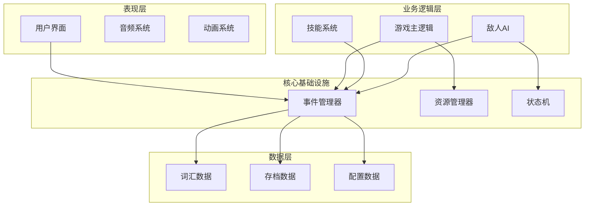
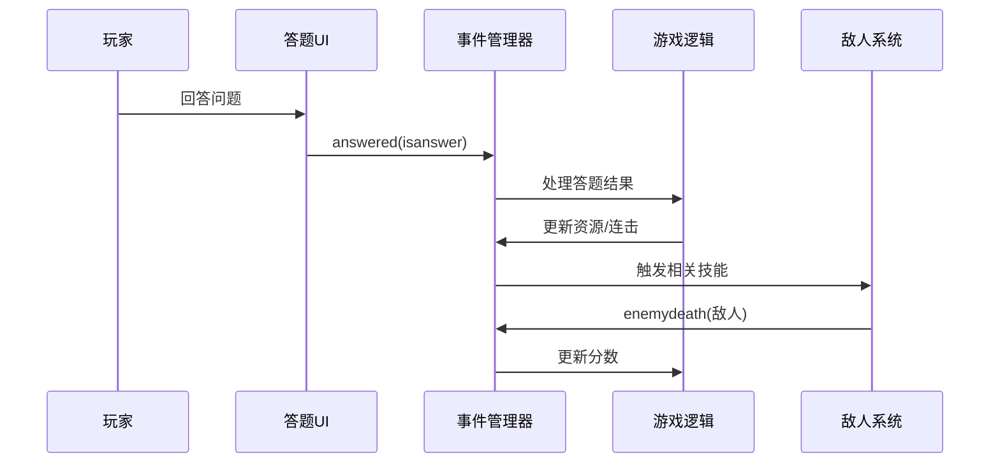
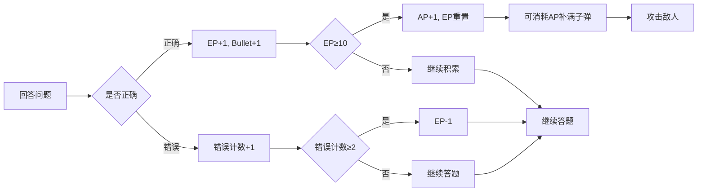
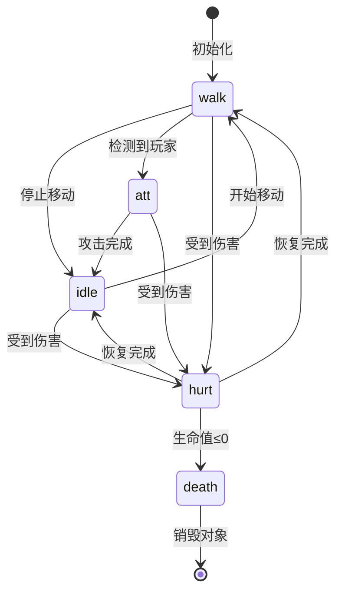
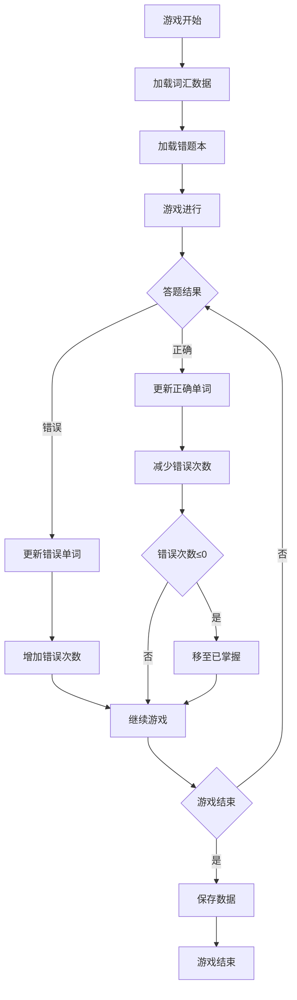
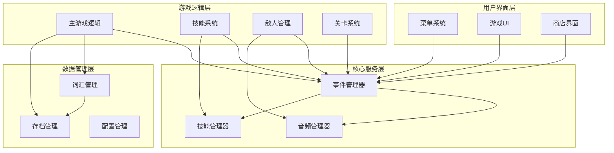
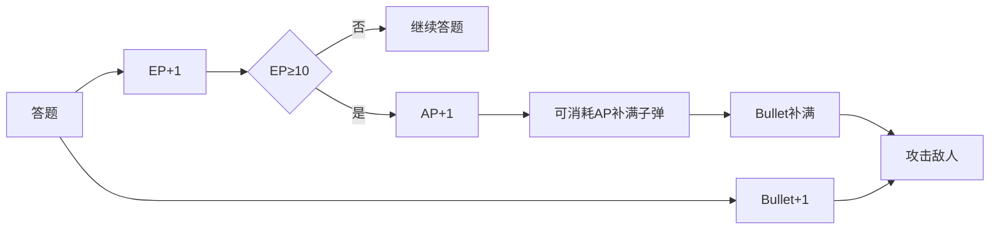

# Tankou（弹口）技术架构文档

## 目录
1. [系统总览](#系统总览)
2. [核心架构组件](#核心架构组件)
3. [模块依赖关系](#模块依赖关系)
4. [关键技术决策](#关键技术决策)
5. [性能考虑](#性能考虑)
6. [扩展性设计](#扩展性设计)

## 系统总览

Tankou是一款基于Godot引擎开发的日语学习塔防游戏，采用事件驱动架构设计，将知识问答与塔防策略深度融合。系统整体架构采用分层设计，各模块通过事件管理器进行解耦通信。

### 整体架构设计



### 核心设计原则

1. **事件驱动解耦**：通过中央事件管理器实现模块间松耦合通信
2. **状态机模式**：敌人AI和游戏流程采用状态机管理复杂状态转换
3. **资源循环系统**：设计EP/Bullet/AP三位一体的资源循环机制
4. **数据持久化**：错题本和游戏进度的可靠存储与恢复

## 核心架构组件

### 事件驱动架构（EventManager）

事件管理器是整个系统的核心通信枢纽，负责协调各模块间的交互。位于[`global/eventmanger.gd`](global/eventmanger.gd:1)，采用单例模式管理全局事件。

#### 核心功能

1. **事件注册与分发**：统一管理所有游戏事件的注册、触发和处理
2. **玩家状态管理**：维护玩家引用和游戏状态
3. **UI元素协调**：处理UI元素间的位置同步和交互

#### 关键代码示例

```gdscript
# 事件信号定义
signal answered(isanswer:bool)           # 答题事件
signal enemydeath(enemynode)             # 敌人死亡事件
signal playershooting                     # 玩家射击事件
signal comboChange                       # 连击变化事件

# 事件处理函数
func enemySpawnfunc(enemynode):
    player.enemy.append(enemynode)

func enemydeathfunc(enemynode):
    # 检查并清理所有无效的敌人引用
    for i in range(player.enemy.size() - 1, -1, -1):
        if not is_instance_valid(player.enemy[i]):
            player.enemy.remove_at(i)
    
    # 移除特定的敌人节点
    if player.enemy.has(enemynode):
        player.enemy.remove_at(player.enemy.find(enemynode))
```

#### 事件流图



### 资源管理系统（EP/Bullet/AP循环）

资源管理系统是游戏的核心机制，位于[`main/main.gd`](main/main.gd:1)，实现了三位一体的资源循环设计。

#### 资源类型与循环机制

| 资源类型 | 获取方式 | 消耗方式 | 战略价值 |
|---------|---------|---------|---------|
| **能量点 (EP)** | 答对+1，答错2次-1 | 积累10点转换为1AP | 长期战略资源 |
| **子弹 (Bullet)** | 答对+1，AP可补满 | 攻击敌人消耗 | 即时战斗资源 |
| **行动点 (AP)** | EP积满10点获得+1 | 消耗1点补满子弹 | 战略转折资源 |

#### 关键代码示例

```gdscript
# 资源管理核心逻辑
func _addcorrectcount(iscorrect):
    if iscorrect:
        if Correctcount >= 10:
            if power < maxpower:
                Eventmanger.actionPointUp.emit()
                power += 1
                Correctcount = 5
            else:
                Correctcount = 10
        else:
            Correctcount += 1
        Eventmanger.correctcountchange.emit()
    else:
        wrongAnswerCount += 1
        if wrongAnswerCount >= 2:
            if Correctcount > 0:
                Correctcount -= 1
            wrongAnswerCount = 0
        Eventmanger.correctcountchange.emit()
```

#### 资源循环图



### 状态机设计（敌人AI）

敌人AI系统采用经典状态机模式，位于[`enemy/base_enemy.gd`](enemy/base_enemy.gd:1)，实现了复杂的行为逻辑管理。

#### 状态定义与转换

```gdscript
enum state{
    idle,       # 待机状态
    walk,       # 移动状态
    att,        # 攻击状态
    hurt,       # 受伤状态
    death,      # 死亡状态
    nothing,    # 空状态
}
```

#### 状态机实现

```gdscript
func _physics_process(_delta: float) -> void:
    match currentState:
        state.idle:
            _state_logic_idle()
        state.walk:
            _state_logic_walk()
        state.att:
            _state_logic_att()
        state.hurt:
            return

func _enter_state(new_state: state):
    var _last_state = currentState
    if new_state != currentState or (new_state == state.hurt and _last_state == state.hurt):
        currentState = new_state
        match currentState:
            state.idle:
                animation_player.play("idle")
            state.walk:
                animation_player.play("walk")
            state.att:
                animation_player.play("att")
                timer.start(attCd)
                # 在动画中途触发攻击伤害
                animation_player.animation_finished.connect(func(_animeName):
                    _enter_state(state.idle), CONNECT_ONE_SHOT)
            # ... 其他状态处理
```

#### 状态转换图



### 数据持久化层

数据持久化层负责管理游戏数据的存储和恢复，位于[`global/jlptn_5.gd`](global/jlptn_5.gd:1)，实现了词汇数据、错题本和游戏进度的可靠管理。

#### 数据结构设计

```gdscript
# 词汇数据结构
var word_data: Dictionary = {}  # 所有词汇数据
var errorWord: Dictionary = {}  # 当前游戏错误单词
var correctWord: Dictionary = {} # 当前游戏正确单词
var savedErrorWord: Array = []  # 历史错误单词
var masteredWord: Dictionary = {} # 已掌握单词
```

#### 错题本管理

```gdscript
func _updateErrorWordCount(word: Dictionary, count_change: int):
    var word_key = word.get("假名", "")
    if word_key.is_empty():
        return
    
    # 检查单词是否在当前错误列表中
    if errorWord.has(word_key):
        var error_word_data = errorWord.get(word_key)
        error_word_data.error_count += count_change
        # 如果错误次数小于等于0，从错误列表中移除
        if error_word_data.error_count <= 0:
            errorWord.erase(word_key)
            masteredWord.set(word_key, word)  # 移至已掌握
    else:
        # 如果单词不在错误列表中且是增加错误次数，则添加新条目
        if count_change > 0:
            var error_word_data = {
                "word_data": word,
                "error_count": count_change
            }
            errorWord.set(word_key, error_word_data)
```

#### 数据持久化流程



## 模块依赖关系

### 模块层次结构



### 关键依赖关系

1. **事件管理器**：所有模块的核心依赖，负责解耦通信
2. **词汇管理器**：游戏逻辑层的基础数据源
3. **主游戏逻辑**：协调各子系统，实现核心游戏循环
4. **技能系统**：依赖事件管理器和技能管理器

## 关键技术决策

### 为什么选择事件驱动架构

#### 决策背景

在游戏开发初期，我们面临多个系统间复杂交互的挑战：答题系统需要影响战斗系统，战斗结果需要反馈到UI系统，技能系统需要响应多种游戏事件。传统的直接调用方式会导致代码耦合度高、难以维护。

#### 事件驱动架构的优势

1. **解耦合**：模块间通过事件通信，降低直接依赖
2. **可扩展性**：新功能可以轻松监听现有事件
3. **可测试性**：各模块可以独立测试
4. **可维护性**：事件流向清晰，便于调试

#### 实现细节

```gdscript
# 事件定义
signal answered(isanswer:bool)
signal enemydeath(enemynode)
signal comboChange

# 事件监听
func _ready() -> void:
    Eventmanger.answered.connect(_addcorrectcount)
    Eventmanger.answered.connect(comboChange)
    Eventmanger.enemydeath.connect(upDatascore)

# 事件触发
func _on_answer_selected(is_correct: bool):
    Eventmanger.answered.emit(is_correct)
```

#### 潜在缺点与解决方案

1. **事件追踪困难**：通过事件日志系统解决
2. **性能开销**：优化事件分发机制，避免不必要的事件
3. **调试复杂性**：开发事件调试工具，可视化事件流

### 资源循环设计原理

#### 设计理念

资源循环系统的设计基于"风险与收益平衡"的游戏设计理念。玩家需要在短期收益（立即获得子弹）和长期投资（积累AP）之间做出策略选择。

#### 三位一体资源循环



#### 平衡性考虑

1. **EP积累速度**：控制AP获取频率，避免资源过剩
2. **AP上限**：限制AP存储数量，强制玩家及时使用
3. **错误惩罚**：答错扣EP，增加答题风险

#### 扩展性设计

```gdscript
# 资源配置化设计
var resource_config = {
    "ep_per_correct": 1,
    "ep_to_ap_threshold": 10,
    "ap_max": 3,
    "bullet_per_correct": 1,
    "ep_penalty_wrong": 1,
    "wrong_threshold": 2
}

# 可调整的资源计算
func calculate_resource_gain(is_correct: bool):
    if is_correct:
        return {
            "ep": resource_config.ep_per_correct,
            "bullet": resource_config.bullet_per_correct
        }
    else:
        return {
            "ep": -resource_config.ep_penalty_wrong
        }
```

### 技能触发器机制

#### 设计目标

技能触发器系统旨在实现灵活的技能激活机制，支持多种触发条件，增强游戏的策略性和可玩性。

#### 触发器类型

```gdscript
# 连击触发器
signal twoComboEmit      # 2连击触发
signal fiveComboEmit      # 5连击触发
signal onComboEmit        # 连击持续触发
signal brokenComboEmit    # 连击中断触发

# 资源触发器
signal APGainedEmit       # AP获得触发
signal APSpentEmit        # AP消耗触发

# 游戏事件触发器
signal enemySpawn         # 敌人生成触发
signal enemydeath         # 敌人死亡触发
```

#### 触发器实现

```gdscript
# 连击系统触发器
func comboChange(iscorrect):
    Eventmanger.comboChange.emit(iscorrect)
    if iscorrect:
        currentExp += 1
        var tempCombo = combo
        combo += 1
        if tempCombo < 2 and combo >= 2:
            on_combo_timer.start()
        if combo > 0 and combo % 2 == 0:
            Eventmanger.twoComboEmit.emit()
        if combo > 0 and combo % 5 == 0:
            Eventmanger.fiveComboEmit.emit()
    else:
        if combo >= 2:
            on_combo_timer.stop()
        if combo > 0:
            Eventmanger.brokenComboEmit.emit()
        combo = 0
```

#### 技能与触发器绑定

```gdscript
# 技能触发器绑定示例
func _ready():
    # 连击技能绑定
    Eventmanger.twoComboEmit.connect(_on_two_combo)
    Eventmanger.fiveComboEmit.connect(_on_five_combo)
    
    # 资源技能绑定
    Eventmanger.APGainedEmit.connect(_on_ap_gained)
    Eventmanger.APSpentEmit.connect(_on_ap_spent)

func _on_two_combo():
    # 触发2连击技能效果
    apply_skill_effect("double_damage")

func _on_five_combo():
    # 触发5连击技能效果
    apply_skill_effect("area_damage")
```

## 性能考虑

### 内存管理

#### 对象池模式

敌人和子弹等频繁创建销毁的对象采用对象池模式，减少内存分配开销：

```gdscript
# 敌人对象池示例
var enemy_pool: Array = []
var max_pool_size: int = 50

func get_enemy(enemy_type: String):
    for enemy in enemy_pool:
        if enemy.enemy_type == enemy_type and not enemy.is_active:
            enemy.reset()
            return enemy
    
    # 池中没有可用对象，创建新对象
    if enemy_pool.size() < max_pool_size:
        var new_enemy = create_enemy(enemy_type)
        enemy_pool.append(new_enemy)
        return new_enemy
    
    return null  # 池已满，无法创建新对象

func return_enemy(enemy):
    enemy.is_active = false
    enemy.hide()
```

#### 资源加载优化

```gdscript
# 预加载关键资源
func preload_resources():
    # 预加载敌人资源
    enemy_scenes = {
        "slime": preload("res://enemy/slime.tscn"),
        "zombie": preload("res://enemy/zomble.tscn"),
        "fly_demon": preload("res://enemy/flyDemon.tscn")
    }
    
    # 预加载技能资源
    skill_scenes = {
        "fire_ball": preload("res://globalSkillData/fireBall.tscn"),
        "turret": preload("res://globalSkillData/turret-bt-7270.tscn")
    }
```

### 渲染优化

#### 视锥剔除

只渲染视野内的对象，减少渲染负担：

```gdscript
func _process(_delta):
    # 获取视野范围
    var viewport_rect = get_viewport().get_visible_rect()
    var camera_pos = $Camera2D.global_position
    var view_bounds = Rect2(
        camera_pos - viewport_rect.size / 2,
        viewport_rect.size
    )
    
    # 更新敌人可见性
    for enemy in active_enemies:
        var enemy_bounds = enemy.get_global_rect()
        enemy.visible = view_bounds.intersects(enemy_bounds)
```

#### 批量渲染

相同类型的对象使用批量渲染，减少draw call：

```gdscript
# 子弹批量渲染
func _draw():
    var bullet_positions: Array = []
    var bullet_colors: Array = []
    
    for bullet in active_bullets:
        bullet_positions.append(bullet.global_position)
        bullet_colors.append(bullet.color)
    
    # 批量绘制所有子弹
    draw_circle_batch(bullet_positions, bullet_colors, bullet_radius)
```

### 计算优化

#### 状态机优化

```gdscript
# 优化状态检查频率
var state_check_timer: Timer
var state_check_interval: float = 0.1  # 100ms检查一次

func _ready():
    state_check_timer = Timer.new()
    state_check_timer.wait_time = state_check_interval
    state_check_timer.timeout.connect(_check_state_transitions)
    add_child(state_check_timer)
    state_check_timer.start()

func _check_state_transitions():
    # 只在定时器触发时检查状态转换
    match currentState:
        state.walk:
            _check_walk_conditions()
        state.idle:
            _check_idle_conditions()
        # ... 其他状态检查
```

#### 事件系统优化

```gdscript
# 事件队列处理
var event_queue: Array = []
var is_processing_events: bool = false

func queue_event(event_name: String, args: Array = []):
    event_queue.append({"name": event_name, "args": args})
    if not is_processing_events:
        _process_event_queue()

func _process_event_queue():
    is_processing_events = true
    while event_queue.size() > 0:
        var event = event_queue.pop_front()
        _process_event(event.name, event.args)
    is_processing_events = false
```

## 扩展性设计

### 模块化架构

#### 插件系统设计

```gdscript
# 技能插件基类
class_name SkillPlugin
extends Resource

var skill_name: String
var skill_description: String
var skill_icon: Texture2D
var skill_cost: int

func apply_effect(target: Node):
    push_error("SkillPlugin.apply_effect() must be implemented by subclass")

func can_activate(context: Dictionary) -> bool:
    return true

# 具体技能实现
class_name FireBallSkill
extends SkillPlugin

func _init():
    skill_name = "火球术"
    skill_description = "发射火球攻击敌人"
    skill_cost = 2

func apply_effect(target: Node):
    var fireball = fireball_scene.instantiate()
    fireball.target = target
    get_tree().current_scene.add_child(fireball)

func can_activate(context: Dictionary) -> bool:
    return context.get("ap", 0) >= skill_cost
```

#### 动态加载系统

```gdscript
# 技能管理器
class_name SkillManager
extends Node

var loaded_skills: Dictionary = {}

func _ready():
    load_all_skills()

func load_all_skills():
    var skill_dir = "res://skill/resource/"
    var dir = DirAccess.open(skill_dir)
    if dir:
        dir.list_dir_begin()
        var file_name = dir.get_next()
        while file_name != "":
            if file_name.ends_with(".tres"):
                var skill_path = skill_dir + file_name
                var skill = load(skill_path)
                if skill is SkillPlugin:
                    loaded_skills[skill.skill_name] = skill
            file_name = dir.get_next()

func get_skill(skill_name: String) -> SkillPlugin:
    return loaded_skills.get(skill_name, null)
```

### 数据驱动设计

#### 配置文件系统

```gdscript
# 游戏配置管理器
class_name ConfigManager
extends Node

var game_config: Dictionary = {}

func _ready():
    load_config()

func load_config():
    var config_file = FileAccess.open("res://config/game_config.json", FileAccess.READ)
    if config_file:
        var json_text = config_file.get_as_text()
        var json = JSON.new()
        var parse_result = json.parse(json_text)
        if parse_result == OK:
            game_config = json.data
        config_file.close()

func get_config(key: String, default_value = null):
    return game_config.get(key, default_value)
```

#### 配置文件示例

```json
{
    "game_balance": {
        "ep_per_correct": 1,
        "ep_to_ap_threshold": 10,
        "ap_max": 3,
        "bullet_per_correct": 1,
        "ep_penalty_wrong": 1,
        "wrong_threshold": 2
    },
    "enemy_settings": {
        "spawn_interval": 2.0,
        "max_enemies": 20,
        "difficulty_scaling": 1.1
    },
    "ui_settings": {
        "animation_speed": 1.0,
        "sound_volume": 0.8,
        "music_volume": 0.6
    }
}
```

### 多语言支持

#### 本地化系统

```gdscript
# 本地化管理器
class_name LocalizationManager
extends Node

var current_language: String = "zh_CN"
var translations: Dictionary = {}

func _ready():
    load_translations()

func load_translations():
    var lang_file = "res://localization/" + current_language + ".json"
    var file = FileAccess.open(lang_file, FileAccess.READ)
    if file:
        var json_text = file.get_as_text()
        var json = JSON.new()
        var parse_result = json.parse(json_text)
        if parse_result == OK:
            translations = json.data
        file.close()

func tr(key: String) -> String:
    return translations.get(key, key)

func set_language(lang: String):
    current_language = lang
    load_translations()
```

#### 本地化文件示例

```json
{
    "ui_start_game": "开始游戏",
    "ui_settings": "设置",
    "ui_exit": "退出",
    "game_score": "分数",
    "game_level": "等级",
    "skill_fireball": "火球术",
    "skill_double_damage": "双重伤害"
}
```

### 平台扩展性

#### 输入系统抽象

```gdscript
# 输入管理器
class_name InputManager
extends Node

var input_handlers: Dictionary = {}

func _ready():
    register_input_handlers()

func register_input_handlers():
    if OS.get_name() == "Android" or OS.get_name() == "iOS":
        input_handlers["primary"] = TouchInputHandler.new()
    else:
        input_handlers["primary"] = KeyboardMouseInputHandler.new()

func get_input(action: String) -> bool:
    for handler in input_handlers.values():
        if handler.is_action_pressed(action):
            return true
    return false

# 输入处理器基类
class_name InputHandler
extends RefCounted

func is_action_pressed(action: String) -> bool:
    push_error("InputHandler.is_action_pressed() must be implemented")
    return false

# 触摸输入处理器
class_name TouchInputHandler
extends InputHandler

func is_action_pressed(action: String) -> bool:
    # 实现触摸输入检测逻辑
    return false

# 键盘鼠标输入处理器
class_name KeyboardMouseInputHandler
extends InputHandler

func is_action_pressed(action: String) -> bool:
    return Input.is_action_pressed(action)
```

#### 平台特定功能

```gdscript
# 平台管理器
class_name PlatformManager
extends Node

func _ready():
    setup_platform_features()

func setup_platform_features():
    match OS.get_name():
        "Android", "iOS":
            setup_mobile_features()
        "Windows", "macOS", "Linux":
            setup_desktop_features()
        "Web":
            setup_web_features()

func setup_mobile_features():
    # 移动平台特定设置
    Engine.max_fps = 60  # 限制帧率节省电量
    
func setup_desktop_features():
    # 桌面平台特定设置
    Engine.max_fps = 144  # 高帧率支持
    
func setup_web_features():
    # Web平台特定设置
    Engine.max_fps = 60  # 浏览器兼容性
```

---

## 总结

Tankou的技术架构采用事件驱动设计，通过模块化、数据驱动和插件化等方式实现了高度的可扩展性和可维护性。核心的EP/Bullet/AP资源循环系统、状态机驱动的敌人AI、以及灵活的技能触发器机制共同构成了游戏的核心玩法基础。

通过合理的性能优化和扩展性设计，系统不仅能够满足当前的功能需求，还为未来的功能扩展和平台移植提供了坚实的技术基础。这种架构设计使得开发团队能够快速迭代新功能，同时保持代码的稳定性和可维护性。