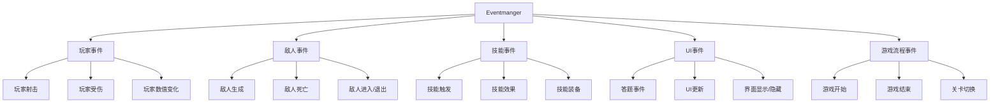
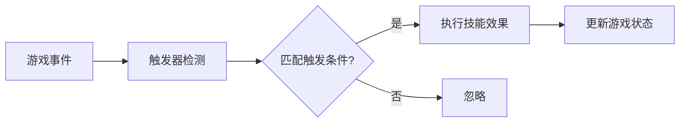
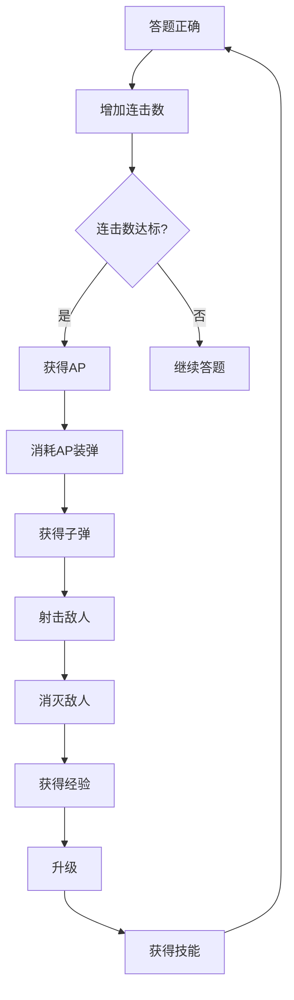
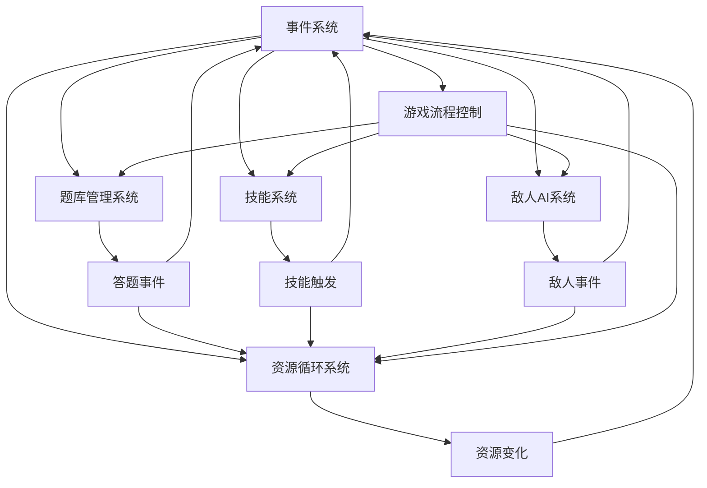

# Tankou 核心系统文档

本文档详细说明Tankou项目的五大核心系统，包括系统架构、API接口、代码示例和系统间交互关系。

## 目录

1. [事件系统（Event System）](#事件系统)
2. [题库管理系统（Question Bank System）](#题库管理系统)
3. [技能系统（Skill System）](#技能系统)
4. [资源循环系统（Resource Loop System）](#资源循环系统)
5. [敌人AI系统（Enemy AI System）](#敌人ai系统)
6. [系统间交互关系](#系统间交互关系)
7. [扩展和修改指南](#扩展和修改指南)

---

## 事件系统

事件系统是Tankou项目的核心通信机制，负责管理游戏内所有事件的分发和处理。基于Godot的信号系统实现，采用单例模式确保全局访问。

### 系统架构

事件系统采用中央事件管理器（[`Eventmanger`](global/eventmanger.gd:1)）作为核心，通过信号机制连接各个游戏组件：



### 核心事件类型

#### 玩家事件

| 信号名称 | 参数 | 触发时机 | 用途 |
|---------|------|----------|------|
| [`playershooting`](global/eventmanger.gd:64) | 无 | 玩家射击时 | 通知其他系统玩家正在射击 |
| [`playerShooted`](global/eventmanger.gd:65) | `enemy`, `position`, `damage` | 射击命中时 | 处理伤害计算和效果 |
| [`playerGotHurt`](global/eventmanger.gd:68) | `damage:int` | 玩家受伤时 | 处理玩家伤害和生命值 |
| [`reloadAmmo`](global/eventmanger.gd:70) | 无 | 开始装弹时 | 触发装弹动画和逻辑 |
| [`playerbulletCount`](global/eventmanger.gd:74) | `count:int` | 子弹数量变化时 | 更新UI显示 |

#### 敌人事件

| 信号名称 | 参数 | 触发时机 | 用途 |
|---------|------|----------|------|
| [`enemySpawn`](global/eventmanger.gd:104) | `enemynode` | 敌人生成时 | 添加到敌人列表 |
| [`enemydeath`](global/eventmanger.gd:106) | `enemynode` | 敌人死亡时 | 从敌人列表移除 |
| [`enterTreeEnemy`](global/eventmanger.gd:100) | 无 | 敌人进入场景树时 | 计数管理 |
| [`exitTreeEnemy`](global/eventmanger.gd:102) | 无 | 敌人退出场景树时 | 计数管理 |

#### 技能事件

| 信号名称 | 参数 | 触发时机 | 用途 |
|---------|------|----------|------|
| [`twoComboEmit`](global/eventmanger.gd:133) | 无 | 2连击时 | 触发连击技能 |
| [`fiveComboEmit`](global/eventmanger.gd:135) | 无 | 5连击时 | 触发高级连击技能 |
| [`APGainedEmit`](global/eventmanger.gd:141) | 无 | 获得AP时 | 触发AP相关技能 |
| [`APSpentEmit`](global/eventmanger.gd:143) | 无 | 消耗AP时 | 触发AP消耗技能 |

#### 答题事件

| 信号名称 | 参数 | 触发时机 | 用途 |
|---------|------|----------|------|
| [`answered`](global/eventmanger.gd:89) | `isanswer:bool` | 答题完成时 | 处理答题结果 |
| [`questionSkipped`](global/eventmanger.gd:93) | 无 | 跳过题目时 | 处理跳过逻辑 |
| [`comboChange`](global/eventmanger.gd:95) | 无 | 连击变化时 | 更新连击状态 |
| [`wordReorderCompleted`](global/eventmanger.gd:97) | 无 | 单词重组完成时 | 给予额外奖励 |

### 事件触发机制

#### 核心方法

```gdscript
# 注册玩家引用
func register_player(player_node):
    player = player_node

# 设置子弹位置
func setbulletPos(_node, who:bool):
    if who:
        answering = _node
    else:
        bullet = _node
    if answering != null and bullet != null:
        await get_tree().process_frame
        var temp = answering.answerPanlePos()
        bullet.position.y = temp.position.y - bullet.size.y

# 敌人生成处理
func enemySpawnfunc(enemynode):
    player.enemy.append(enemynode)

# 敌人死亡处理
func enemydeathfunc(enemynode):
    # 检查并清理所有无效的敌人引用
    for i in range(player.enemy.size() - 1, -1, -1):
        if not is_instance_valid(player.enemy[i]):
            player.enemy.remove_at(i)
    
    # 移除特定的敌人节点
    if player.enemy.has(enemynode):
        player.enemy.remove_at(player.enemy.find(enemynode))

# 添加当前弹药
func addCurrentAmmo(isanswer:bool):
    if isanswer:
        player.currentAmmo += 1
```

### 代码示例

#### 发射事件

```gdscript
# 在玩家类中发射射击事件
func baseshootingline():
    # ... 射击逻辑 ...
    Eventmanger.playerShooted.emit(enemy[i], ends, baseDamage)
    Eventmanger.playershooting.emit(currentAmmo)
```

#### 监听事件

```gdscript
# 在主游戏中监听事件
func _ready() -> void:
    Eventmanger.answered.connect(_addcorrectcount)
    Eventmanger.enemydeath.connect(upDatascore)
    Eventmanger.comboChange.connect(comboChange)
```

---

## 题库管理系统

题库管理系统负责管理JLPT日语单词数据，支持多级别单词本、错题记录、智能出题等功能。

### 数据结构

#### 单词本配置

```gdscript
# 单词本文件路径配置
var wordBookPath: Dictionary = {
    "JLPTN5": 'res://word/JLPTN5.csv',
    "JLPTN4": 'res://word/JLPTN4.csv'
}

# 当前使用的单词本列表
var wordBookList: Array = ["JLPTN5"]

# 所有已加载的单词数据
var word_data: Dictionary = {}
```

#### 单词数据格式

每个单词包含以下字段：

| 字段名 | 类型 | 说明 |
|--------|------|------|
| 中文翻译 | String | 单词的中文含义 |
| 日语汉字 | String | 单词的汉字写法 |
| 假名 | String | 单词的假名读音 |
| 容易混淆的单词 | String | 容易混淆的相似单词 |

#### 错题本机制

```gdscript
# 当前游戏错误单词
var errorWord: Dictionary  # 键为假名，值为包含单词数据和错误次数的结构

# 历史累计错误单词
var allErrorWord: Array

# 已掌握单词
var masteredWord: Dictionary

# 错误单词数据结构
var error_word_data = {
    "word_data": word_dict,
    "error_count": 3  # 初始错误次数
}
```

### 题目生成算法

#### 普通选择题生成

```gdscript
func _setNormalQuestion():
    # 获取随机题目单词
    var temp_Tiltle: Dictionary = Jlptn5._getNextWordData()
    var temp_key = temp_Tiltle.keys()[0]
    tiltle = temp_Tiltle.get(temp_key)
    
    # 获取错误选项
    error_word = Jlptn5._getErrorWordData()
    error_word.append(tiltle.get("容易混淆的单词"))
    
    # 随机分配正确答案位置
    var Correct: int = randi() % 4
    
    # 创建4个选项按钮
    for i in range(4):
        if i != Correct:
            # 创建错误选项
            temp._setData(false, error_word[tempy])
        else:
            # 创建正确选项
            if not tiltle.get("日语汉字").is_empty():
                if randi() % 10 < 8:
                    temp._setData(true, tiltle.get("日语汉字"))
                else:
                    temp._setData(true, tiltle.get("假名"))
```

#### 特殊题型触发

每5道题触发特殊题型：

```gdscript
func _triggerSpecialQuestion():
    var random_number = randi() % 10
    
    if random_number <= 4:
        # 错题复习模式
        _setErrorReviewQuestion()
    else:
        # 单词重组模式
        _setWordReorderQuestion()
```

#### 错题复习模式

```gdscript
func _setErrorReviewQuestion():
    # 获取错误次数最高的单词
    var error_review_word = Jlptn5._getHighestErrorWord()
    
    if error_review_word == null:
        _setNormalQuestion()
        return
    
    # 使用错题作为普通选择题
    title_label.text = "错题复习：选择\"" + temp_key + "\"的日文翻译"
    # ... 创建选项逻辑 ...
```

#### 单词重组模式

```gdscript
func _setWordReorderQuestion():
    # 获取已掌握的单词
    var mastered_word = Jlptn5._getMasteredWordForReorder()
    
    # 获取单词重组数据
    word_reorder_data = Jlptn5._getWordReorderData(tiltle)
    
    # 创建字符按钮
    for character in word_reorder_data.all_options:
        var char_button = Button.new()
        char_button.text = character
        char_button.pressed.connect(_on_character_button_pressed.bind(character, char_button))
```

### 数据持久化

#### 保存错题数据

```gdscript
func _saveErrorWord():
    var savepath = "user://saveErrorWordData.json"
    var saveMasteredPath = "user://masteredWordData.json"
    
    # 合并错误单词数据
    var saved_word_dict: Dictionary = {}
    for saved_word in exitWord:
        if typeof(saved_word) == TYPE_DICTIONARY and saved_word.has("word_data"):
            var word_key = saved_word.word_data.get("假名", "")
            if not word_key.is_empty():
                saved_word_dict[word_key] = saved_word
    
    # 保存到文件
    var file = FileAccess.open(savepath, FileAccess.WRITE)
    if file:
        var tempjson = JSON.stringify(error_save_array, "\t")
        file.store_string(tempjson)
```

#### 加载错题数据

```gdscript
func _loadErrorWord():
    var savepath = "user://saveErrorWordData.json"
    
    if FileAccess.file_exists(savepath):
        var openData = FileAccess.open(savepath, FileAccess.READ)
        if openData:
            var tempjson = openData.get_as_text()
            var tempData = JSON.parse_string(tempjson)
            if typeof(tempData) == TYPE_ARRAY:
                savedErrorWord = tempData
```

### API接口

#### 核心方法

| 方法名 | 参数 | 返回值 | 说明 |
|--------|------|--------|------|
| [`_gameStart()`](global/jlptn_5.gd:352) | 无 | 无 | 游戏开始时初始化单词数据 |
| [`_getNextWordData()`](global/jlptn_5.gd:325) | 无 | Dictionary | 获取下一个题目单词数据 |
| [`_getErrorWordData()`](global/jlptn_5.gd:334) | 无 | Array | 获取2个错误选项 |
| [`_addCorrectWord()`](global/jlptn_5.gd:67) | `sword:Dictionary` | 无 | 添加正确单词 |
| [`_addErrorWord()`](global/jlptn_5.gd:57) | `sword:Dictionary` | 无 | 添加错误单词 |
| [`_updateErrorWordCount()`](global/jlptn_5.gd:72) | `word:Dictionary`, `count_change:int` | 无 | 更新单词错误次数 |
| [`_getHighestErrorWord()`](global/jlptn_5.gd:362) | 无 | Dictionary | 获取错误次数最高的单词 |
| [`_getWordReorderData()`](global/jlptn_5.gd:380) | `target_word:Dictionary` | Dictionary | 获取单词重组数据 |

---

## 技能系统

技能系统管理游戏中的各种技能效果，包括技能触发、效果应用、装备管理等。

### 技能触发器机制

技能系统基于事件触发器工作，当特定游戏事件发生时自动触发相应技能：



#### 触发器类型

| 触发器名称 | 触发条件 | 对应信号 |
|------------|----------|----------|
| 连击触发器 | 达到特定连击数 | `twoComboEmit`, `fiveComboEmit` |
| AP触发器 | 获得/消耗AP | `APGainedEmit`, `APSpentEmit` |
| 答题触发器 | 答对/答错题目 | `answered` |
| 敌人事件触发器 | 敌人死亡/生成 | `enemydeath`, `enemySpawn` |

### 技能类型和效果

#### 技能数据结构

```gdscript
# 技能资源基类
extends Resource
class_name skill

@export var skill_type: String      # 技能类型
@export var skill_name: String      # 技能名称
@export var skill_cname: String     # 技能中文名
@export var sprite: Texture         # 技能图标
@export var tips: String           # 技能说明
@export var path: String           # 技能场景路径
@export var derivedSkill: Dictionary[String, Dictionary]  # 派生技能
```

#### 可用技能列表

| 技能名称 | 技能类型 | 效果说明 | 资源路径 |
|---------|----------|----------|----------|
| doubleShoot | 攻击增强 | 双重射击 | `res://skill/resource/doubleShoot.tres` |
| cdSub | 冷却缩减 | 减少射击冷却 | `res://skill/resource/cdSub.tres` |
| baseDamageUp | 伤害增强 | 增加基础伤害 | `res://skill/resource/baseDamageUp.tres` |
| ricochetShoot | 特殊攻击 | 弹跳射击 | `res://skill/resource/ricochetShoot.tres` |
| BT-7270 | 防御塔 | 自动炮塔 | `res://skill/resource/BT-7270.tres` |
| fullPower | 能量爆发 | 全力攻击 | `res://skill/resource/fullPower.tres` |
| trueDamageUp | 真实伤害 | 增加真实伤害 | `res://skill/resource/trueDamageUp.tres` |

#### 技能效果实现

```gdscript
# 基础伤害提升
func BaseDamageUp():
    attackBonus += 10  # 增加10%攻击力

# 射击冷却缩减
func BaseShootCdSub():
    baseshootCD -= 0.1  # 减少0.1秒冷却

# 真实伤害提升
func TrueDamageUp():
    trueDamageRatio = trueDamageRatio + 0.3  # 增加30%真实伤害比例

# 子弹数量变化
func _bulletCountChangeFunc(count: int):
    bulletCount += count
```

### 技能装备和管理

#### 技能管理器

```gdscript
extends Node

# 技能数据路径配置
var _skillDataPath: Dictionary = {
    "doubleShoot": 'res://skill/resource/doubleShoot.tres',
    "cdSub": 'res://skill/resource/cdSub.tres',
    # ... 其他技能路径
}

# 技能数据管理
var _skillDataManager: Dictionary = {}
var _skillDataCopy: Dictionary = {}

# 技能数量配置
var _SkillCount: Dictionary = {
    "doubleShoot": 1,
    "cdSub": 9,
    "baseDamageUp": 5,
    # ... 其他技能数量
}
```

#### 技能获取机制

```gdscript
# 获取随机技能
func _getRandomSkill():
    var RandomSkill: Array = []
    if _skillDataCopy.size() > 3:
        var tempkeys = _skillDataCopy.keys()
        for i in range(3):
            var temp = randi() % tempkeys.size()
            RandomSkill.append(_skillDataCopy.get(tempkeys.get(temp)))
            tempkeys.remove_at(temp)
    return RandomSkill

# 减少技能库存
func _SubSkillBox(SkillName: String):
    if _skillDataCopy.has(SkillName) and _SkillCountCopy.has(SkillName):
        if _SkillCountCopy.get(SkillName) > 1:
            _SkillCountCopy.set(SkillName, _SkillCountCopy.get(SkillName) - 1)
        else:
            _skillDataCopy.erase(SkillName)
```

### 代码实现示例

#### 技能触发连接

```gdscript
# 在玩家类中连接技能信号
func _ready() -> void:
    Eventmanger.playerCdSub.connect(BaseShootCdSub)
    Eventmanger.playerbulletCount.connect(_bulletCountChangeFunc)
    Eventmanger.playerBaseDamageUp.connect(BaseDamageUp)
    Eventmanger.playerTrueDamageUp.connect(TrueDamageUp)
```

#### 伤害计算系统

```gdscript
func calculate_damage(enemy_armor: float = 0.0) -> float:
    # 基础伤害计算
    var attack_bonus = float(attackBonus) / 100.0
    var global_damage_bonus = float(globalDamageBonus) / 100.0
    var base_damage = baseDamage * (1.0 + attack_bonus) * (1.0 + global_damage_bonus)
    
    # 真实伤害计算
    var true_damage = base_damage * trueDamageRatio
    
    # 普通伤害计算(考虑护甲)
    var normal_damage = base_damage * (1.0 - clampf(enemy_armor, 0.0, 1.0))
    
    # 暴击判定和计算
    var is_crit = randf() < (float(criticalChance) / 100.0)
    var final_normal_damage = normal_damage
    if is_crit:
        final_normal_damage = normal_damage * (1.0 + float(criticalRatio) / 100.0)
    
    # 最终伤害 = 真实伤害 + 普通伤害(可能暴击)
    var final_damage = true_damage + final_normal_damage
    
    return final_damage
```

---

## 资源循环系统

资源循环系统管理游戏中的各种资源，包括能量点(EP)、子弹(Bullet)、行动点(AP)等，形成完整的资源循环机制。

### EP（能量点）机制

#### 能量点获取

```gdscript
# 在主游戏中管理能量点
var maxpower: int = 3  # 最大能量点
var power: int = 1     # 当前能量点

# 答题正确时增加能量点
func _addcorrectcount(iscorrect):
    if iscorrect:
        if Correctcount >= 10:
            if power < maxpower:
                Eventmanger.actionPointUp.emit()
                power += 1
                Correctcount = 5
            else:
                Correctcount = 10
        else:
            Correctcount += 1
```

#### 能量点消耗

```gdscript
# 装弹消耗能量点
func reloadAmmofunc():
    if get_tree().get_first_node_in_group("main").power > 0:
        get_tree().get_first_node_in_group("main").power -= 1
        _enter_state(State.RELOAD)
    else:
        _showTips("无法重新装弹")
```

### Bullet（子弹）系统

#### 子弹管理

```gdscript
# 子弹数量配置
var MaxAmmo = 7          # 最大子弹数
var currentAmmo = 0      # 当前子弹数
var bulletCount: int = 1 # 单次射击子弹数

# 射击消耗子弹
func baseshootingline():
    if currentAmmo <= 0 and (not reloading):
        Eventmanger.reloadAmmo.emit()
        return
    
    # 执行射击逻辑
    currentAmmo -= 1
    Eventmanger.playershooting.emit(currentAmmo)
```

#### 装弹机制

```gdscript
# 装弹完成
func reloadFinishfunc():
    reloading = false
    currentAmmo = MaxAmmo
    Eventmanger.FinishReloadAmmo.emit()
    Eventmanger.actionPoinSub.emit()
    _returnidle()
```

### AP（行动点）管理

#### 行动点获取

行动点主要通过答题正确获得：

```gdscript
# 答题正确获得AP
if Correctcount >= 10:
    if power < maxpower:
        Eventmanger.actionPointUp.emit()  # 发送AP增加信号
        power += 1
```

#### 行动点消耗

```gdscript
# 装弹消耗AP
func reloadAmmofunc():
    if get_tree().get_first_node_in_group("main").power > 0:
        get_tree().get_first_node_in_group("main").power -= 1
        # 装弹逻辑
```

### 资源转换规则

#### 资源循环流程



#### 转换规则表

| 源资源 | 目标资源 | 转换条件 | 转换比例 |
|--------|----------|----------|----------|
| 答题正确 | 连击数 | 答对题目 | +1连击 |
| 连击数 | AP | 连击数≥10 | +1 AP |
| AP | 子弹 | 消耗1 AP | 装满弹夹 |
| 子弹 | 伤害 | 射击敌人 | 造成伤害 |
| 消灭敌人 | 经验 | 敌人死亡 | +1经验 |
| 经验 | 等级 | 经验达标 | 升级 |
| 等级 | 技能 | 升级时 | 获得新技能 |

### 连击系统

#### 连击机制

```gdscript
# 连击变化处理
func comboChange(iscorrect):
    Eventmanger.comboChange.emit(iscorrect)
    if iscorrect:
        Eventmanger.parryInvincible.emit()
        currentExp += 1
        var tempCombo = combo
        combo += 1
        if tempCombo < 2 and combo >= 2:
            on_combo_timer.start()
        if combo > 0 and combo % 2 == 0:
            Eventmanger.twoComboEmit.emit()
        if combo > 0 and combo % 5 == 0:
            Eventmanger.fiveComboEmit.emit()
    else:
        if combo >= 2:
            on_combo_timer.stop()
        if combo > 0:
            Eventmanger.brokenComboEmit.emit()
        combo = 0
```

#### 连击奖励

| 连击数 | 奖励内容 | 触发信号 |
|--------|----------|----------|
| 2 | 触发2连击技能 | `twoComboEmit` |
| 5 | 触发5连击技能 | `fiveComboEmit` |
| 10 | 获得1 AP | `actionPointUp` |

---

## 敌人AI系统

敌人AI系统负责管理敌人的行为逻辑、状态机设计和关卡生成，提供具有挑战性的游戏体验。

### 状态机设计

#### 敌人状态枚举

```gdscript
enum state {
    idle,    # 待机状态
    walk,    # 移动状态
    att,     # 攻击状态
    hurt,    # 受伤状态
    death,   # 死亡状态
    nothing, # 空状态
}
```

#### 状态机实现

```gdscript
# 状态机核心逻辑
func _physics_process(_delta: float) -> void:
    match currentState:
        state.idle:
            _state_logic_idle()
        state.walk:
            _state_logic_walk()
        state.att:
            _state_logic_att()
        state.hurt:
            return  # 受伤状态不执行物理逻辑

# 状态进入逻辑
func _enter_state(new_state: state):
    var _last_state = currentState
    if new_state != currentState or (new_state == state.hurt and _last_state == state.hurt):
        currentState = new_state
        match currentState:
            state.idle:
                animation_player.play("idle")
            state.walk:
                animation_player.play("walk")
            state.att:
                animation_player.play("att")
                timer.start(attCd)
            state.hurt:
                animation_player.play("hurt")
            state.death:
                animation_player.play("death")
```

### 敌人类型和属性

#### 基础属性

```gdscript
var armor: float = 0.0    # 护甲值
var speed: int = 50       # 移动速度
var attCd: int = 10       # 攻击冷却
var damage: int = 1       # 攻击伤害
var health: int           # 生命值
```

#### 敌人类型配置

```gdscript
# 敌人路径配置
var enemyspath: Array = [
    'res://enemy/zomble.tscn',    # 僵尸
    'res://enemy/flyDemon.tscn',  # 飞行恶魔
    'res://enemy/slime.tscn',     # 史莱姆
]
```

#### 属性初始化

```gdscript
func initData(Mul: float):
    var temp = Level.currentLevel
    health = int(temp / 5.0) * 2 + 5
    var tempRandf: float = randf_range(0.8, 1.2)
    speed = int(speed * tempRandf)
    
    if Mul > 1:  # 精英敌人属性增强
        var healthMul: float = Mul
        var sizeMul: float = Mul
        var speedMul: float = 2.0 - Mul
        var damageMul: float = Mul
        health = int(health * healthMul)
        self.scale = self.scale * sizeMul
        speed = int(speed * speedMul)
        damage = int(damage * damageMul)
    
    # 限制最小移动速度
    if speed < 25:
        speed = 25
```

### 行为逻辑

#### 移动逻辑

```gdscript
func _state_logic_walk():
    var direction = global_position.direction_to(player.global_position)
    velocity = direction * speed
    move_and_slide()
    
    # 朝向处理
    if direction.x != 0:
        var targetDir = direction.x > 0
        if targetDir != currentFacingDir:
            currentFacingDir = targetDir
            if targetDir:
                scale.x = baseScale.x
            else:
                scale.x = -baseScale.x

    # 检测是否可以攻击
    if not playerbox.is_empty():
        _enter_state(state.att)
```

#### 攻击逻辑

```gdscript
func _state_logic_att():
    velocity = Vector2.ZERO
    move_and_slide()

# 攻击执行
func att():
    if playerbox.is_empty():
        return
    var i = 0
    var temp = playerbox[i] as Node2D
    var maxcount = playerbox.size() - 1
    while not temp.has_method("getHurt"):
        i += 1
        if i > maxcount:
            return
        temp = playerbox[i]
    temp.getHurt(damage)
```

#### 受伤处理

```gdscript
func getHurt(_damage):
    health -= _damage
    if health <= 0:
        _enter_state(state.death)
    else:
        _enter_state(state.hurt)
```

### 关卡生成

#### 关卡配置

```gdscript
var currentLevel: int = 0        # 当前关卡
var enemysSpanwFinsh: Array = [] # 敌人生成完成状态
var spawnQueue: Array            # 生成队列
```

#### 生成队列算法

```gdscript
func getSpawnQueue():
    var baseEnemyCount: int = (currentLevel - 1) * 3 + 5
    var eliiteEnemyCount: int = int(baseEnemyCount / 5.0)
    var baseEnemys: Array
    var enemysSpawnType: int = min((currentLevel - 1) / 5.0 + 1, enemys.size())
    
    # 选择敌人类型
    for i in range(enemysSpawnType):
        baseEnemys.append(enemys.get(enemysKeys[i]))
        
    # 生成普通敌人
    for i in range(baseEnemyCount):
        var temp = baseEnemys[((randi() % baseEnemys.size()) - 1)]
        var mul = 1
        var temparray = [temp, mul]
        spawnQueue.append(temparray)
        
    # 生成精英敌人
    for i in range(eliiteEnemyCount):
        var temp = baseEnemys[((randi() % baseEnemys.size()) - 1)]
        var mul = randf_range(1.2, 1.8)
        var temparray = [temp, mul]
        spawnQueue.append(temparray)
        
    # 每5关生成Boss
    if currentLevel % 5 == 0:
        var boss
        var mul = 2.0
        if (currentLevel / 5.0) <= enemys.size() - 1:
            boss = enemys.get(enemysKeys[currentLevel / 5.0])
        else:
            var temp = randi() % enemys.size()
            boss = enemys.get(temp)
        var temparray = [boss, mul]
        spawnQueue.append(temparray)
    
    spawnQueue.shuffle()
    return spawnQueue
```

#### 敌人生成逻辑

```gdscript
func spawnenemy(_spawnQueue: Array, spawncd: float):
    enemysSpanwFinsh.append(false)
    var cd = spawncd
    
    if get_tree().get_first_node_in_group("main") == null:
        print("找不到main场景，游戏可能结束了。by:level.gd")
        return
        
    var obj = _spawnQueue.pop_front()
    var tempPack = obj[0]
    var tempMul = obj[1]
    var temptimer = get_tree().create_timer(cd, false)
    
    var temp = tempPack.instantiate()
    temp.initData(tempMul)
    temp.position = getrandipos()
    get_tree().get_first_node_in_group("main").add_child.call_deferred(temp)
    
    cd -= 0.05
    if cd <= 0.5:
        cd = 1
        
    if _spawnQueue.is_empty():
        enemysSpanwFinsh.clear()
        return
        
    temptimer.timeout.connect(func():
        spawnenemy(_spawnQueue, cd)
    )
```

#### 随机位置生成

```gdscript
func getrandipos():
    var randipos: Vector2
    if randi() % 2:
        randipos.x = viewport.position.x
        randipos.y = randf_range(viewport.size.y * 0.75, 0)
    else:
        randipos.x = viewport.size.x
        randipos.y = randf_range(viewport.size.y * 0.75, 0)
    return randipos
```

---

## 系统间交互关系

Tankou的五大核心系统通过事件系统紧密连接，形成完整的游戏循环。

### 系统交互图



### 主要交互流程

#### 答题流程

1. **题库管理系统** 生成题目
2. 玩家答题后触发 **answered** 信号
3. **事件系统** 分发信号到：
   - **资源循环系统**：更新连击数、AP、子弹
   - **技能系统**：触发连击相关技能
   - **题库管理系统**：更新错题记录

#### 战斗流程

1. **敌人AI系统** 生成敌人并移动
2. 玩家射击触发 **playershooting** 信号
3. **事件系统** 分发信号到：
   - **资源循环系统**：消耗子弹
   - **技能系统**：触发射击相关技能
4. 敌人死亡触发 **enemydeath** 信号
5. **事件系统** 分发信号到：
   - **资源循环系统**：增加经验、金币

#### 技能触发流程

1. **资源循环系统** 状态变化（连击、AP等）
2. 触发相应信号（如 **twoComboEmit**）
3. **事件系统** 分发信号到：
   - **技能系统**：执行技能效果
   - **资源循环系统**：应用资源变化

### 关键信号连接

| 信号 | 发送系统 | 接收系统 | 用途 |
|------|----------|----------|------|
| `answered` | 题库管理系统 | 资源循环系统、技能系统 | 答题结果处理 |
| `playershooting` | 资源循环系统 | 技能系统 | 射击事件处理 |
| `enemydeath` | 敌人AI系统 | 资源循环系统 | 敌人死亡奖励 |
| `twoComboEmit` | 资源循环系统 | 技能系统 | 2连击技能触发 |
| `APGainedEmit` | 资源循环系统 | 技能系统 | AP获得技能触发 |

---

## 扩展和修改指南

### 添加新技能

#### 1. 创建技能资源文件

在 `skill/resource/` 目录下创建新的 `.tres` 文件：

```gdscript
[gd_resource type="Resource" script_class="skill" load_steps=2 format=3 uid="uid://..."]

[ext_resource type="Texture2D" uid="uid://..." path="res://skill/asset/new_skill.png" id="1_..."]

[resource]
script_class = "skill"
skill_type = "new_type"
skill_name = "newSkill"
skill_cname = "新技能"
sprite = ExtResource("1_...")
tips = "技能说明"
path = "res://skill/scene/new_skill.tscn"
```

#### 2. 添加技能场景

在 `skill/scene/` 目录下创建技能场景文件。

#### 3. 注册技能

在 [`skill_manager.gd`](global/skill_manager.gd:1) 中添加技能：

```gdscript
var _skillDataPath: Dictionary = {
    # 现有技能...
    "newSkill": 'res://skill/resource/newSkill.tres',
}

var _SkillCount: Dictionary = {
    # 现有技能数量...
    "newSkill": 3,  # 技能数量
}
```

#### 4. 实现技能效果

在玩家类中添加技能效果处理：

```gdscript
func newSkillEffect():
    # 技能效果逻辑
    pass

# 在 _ready() 中连接信号
func _ready() -> void:
    Eventmanger.newSkillTrigger.connect(newSkillEffect)
```

### 添加新敌人类型

#### 1. 创建敌人场景

在 `enemy/` 目录下创建新的敌人场景，继承自 [`base_enemy`](enemy/base_enemy.gd:1)。

#### 2. 自定义敌人行为

```gdscript
extends baseEnemy

func _ready() -> void:
    super._ready()
    # 自定义初始化

func _state_logic_walk():
    super._state_logic_walk()
    # 自定义移动逻辑

func att():
    super.att()
    # 自定义攻击逻辑
```

#### 3. 注册敌人类型

在 [`level.gd`](global/level.gd:1) 中添加敌人路径：

```gdscript
var enemyspath: Array = [
    # 现有敌人...
    'res://enemy/new_enemy.tscn',
]
```

### 扩展题库系统

#### 1. 添加新单词本

在 `word/` 目录下添加新的CSV文件，格式与现有文件一致。

#### 2. 注册单词本

在 [`jlptn_5.gd`](global/jlptn_5.gd:1) 中添加单词本路径：

```gdscript
var wordBookPath: Dictionary = {
    # 现有单词本...
    "JLPTN3": 'res://word/JLPTN3.csv',
}
```

#### 3. 实现新题型

在 [`answering.gd`](main/UI/answering.gd:1) 中添加新题型逻辑：

```gdscript
func _setNewQuestionType():
    current_question_type = "new_type"
    # 新题型实现逻辑
```

### 修改资源循环

#### 1. 添加新资源类型

在主游戏中添加新资源变量：

```gdscript
var new_resource: int = 0
```

#### 2. 实现资源获取和消耗

```gdscript
func gain_new_resource():
    new_resource += 1
    Eventmanger.newResourceGained.emit()

func spend_new_resource():
    if new_resource > 0:
        new_resource -= 1
        # 消耗效果
```

#### 3. 添加相关信号

在 [`eventmanger.gd`](global/eventmanger.gd:1) 中添加新信号：

```gdscript
signal newResourceGained
signal newResourceSpent
```

### 性能优化建议

#### 1. 对象池管理

对于频繁创建销毁的对象（如子弹、特效），使用对象池：

```gdscript
class_name BulletPool extends Node
var available_bullets: Array[Node2D] = []
var active_bullets: Array[Node2D] = []

func get_bullet():
    if available_bullets.is_empty():
        return create_new_bullet()
    return available_bullets.pop_back()

func return_bullet(bullet: Node2D):
    active_bullets.erase(bullet)
    available_bullets.append(bullet)
```

#### 2. 事件优化

避免在单帧内触发过多事件：

```gdscript
# 批量处理事件
func process_events_batch():
    for event in event_queue:
        process_single_event(event)
    event_queue.clear()
```

#### 3. 内存管理

定期清理无效引用：

```gdscript
func cleanup_invalid_references():
    for i in range(enemy.size() - 1, -1, -1):
        if not is_instance_valid(enemy[i]):
            enemy.remove_at(i)
```

### 调试和测试

#### 1. 调试工具

```gdscript
# 调试模式开关
var debug_mode: bool = false

func _ready() -> void:
    if OS.is_debug_build():
        debug_mode = true

func debug_print(message: String):
    if debug_mode:
        print("[DEBUG] ", message)
```

#### 2. 测试函数

```gdscript
# 测试技能触发
func test_skill_trigger():
    Eventmanger.twoComboEmit.emit()
    Eventmanger.fiveComboEmit.emit()

# 测试资源循环
func test_resource_loop():
    # 模拟答题正确
    Eventmanger.answered.emit(true)
    # 检查资源变化
    assert(power > 0, "AP应该增加")
```

---

*本文档基于Tankou项目实际代码分析编写，如有疑问请参考对应源码文件。*