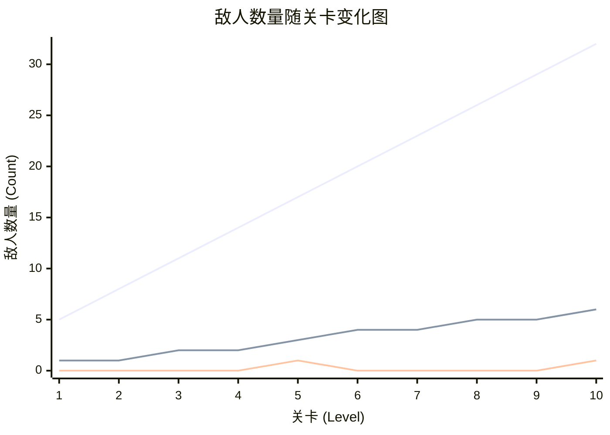
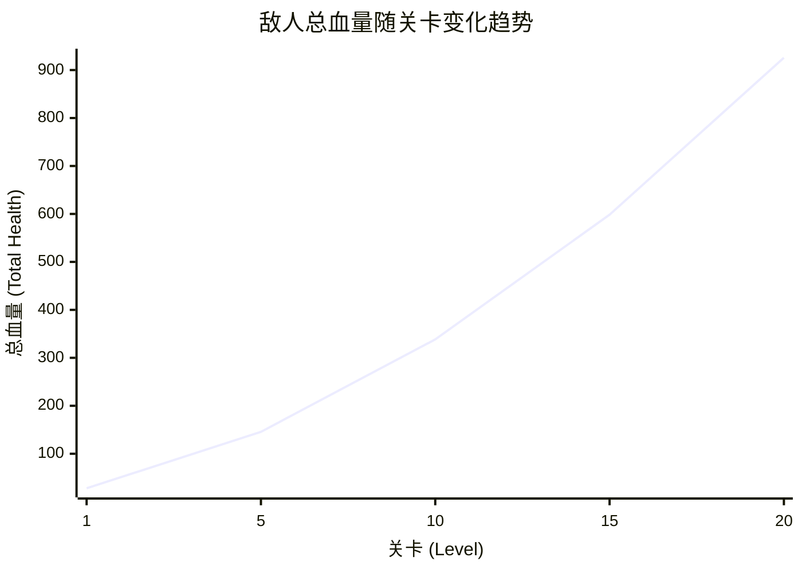

***

# 游戏策划案：防御塔-答题 (Quiz-Defense)

### **游戏机制核心概念总结：防御塔-答题**

这是一个将**知识问答**与**塔防策略**深度融合的游戏机制。玩家的核心任务是通过回答问题来获取战斗资源，并利用这些资源和策略性技能来抵御敌人的进攻。

游戏的核心在于平衡**知识储备**、**风险管理**和**战术决策**。

**实现状态：✅ 已完成**
- 知识问答系统已实现基础选择题机制
- 塔防策略系统已实现玩家固定防御塔
- 资源获取循环（答题→资源→战斗）已建立
- 技能触发器系统已实现

### **一、题库系统设计**

题库系统是游戏的知识内容基础，为答题机制提供丰富的日语学习素材。系统采用JLPT（日本语能力测试）标准分级，确保内容的系统性和渐进性。

#### 1. 题库分级规划

| JLPT级别 | 词汇数量 | 难度等级 | 设计目标 | 当前状态 |
| :--- | :--- | :--- | :--- | :--- |
| **N5** | 600词 | 入门级 | 基础日常词汇，适合初学者 | ✅ 已完成 |
| **N4** | 400词 | 初级 | 基础语法词汇，构建语言框架 | ✅ 已完成 |
| **N3** | 1000+词 | 中级 | 进阶词汇，提升表达能力 |  ✅ 已实现 |
| **N2** | 1000词 | 中高级 | 复杂词汇，接近母语水平 | ❌ 未实现 |
| **N1** | 1500词 | 高级 | 专业词汇，达到熟练运用 | ❌ 未实现 |

**总计：4300个词汇**

**实现状态分析：**
- ❌ N2和N1级别：尚未实现任何配置


#### 2. 题库数据结构

每个词汇条目包含完整的语言学习信息：

| 字段名称 | 数据类型 | 说明 | 示例 |
| :--- | :--- | :--- | :--- |
| **假名** | 字符串 | 日语读音 | あさごはん |
| **日语汉字** | 字符串 | 汉字写法 | 朝ご飯 |
| **中文翻译** | 字符串 | 中文含义 | 早饭 |
| **容易混淆的单词** | 字符串 | 相似词汇 | ひるごはん |
| **混淆词翻译** | 字符串 | 混淆词含义 | 午饭 |

**实现状态：✅ 已完成**
- 核心字段已实现并正常使用
- 实际实现支持动态字段加载，比策划案更灵活
- 使用"假名"作为唯一键值进行数据管理
- "容易混淆的单词"字段已在题目生成中使用

#### 3. 题库选择机制

- **完全开放**：所有题库对玩家完全开放，无解锁限制
- **自由选择**：玩家可自由选择任意级别进行练习
- **多级别组合**：支持同时选择多个级别的题库进行混合练习
- **默认配置**：游戏默认启用N5级别题库

**实现状态：🔄 部分实现**
- ✅ 基础架构：_setWordBookList方法已实现
- ✅ 默认配置：默认启用JLPTN5
- ✅  UI界面：在menu界面实现题库选择
- ✅ 多级别组合：可以同时选择多个题库。


### **二、题目类型设计**

题目类型设计旨在提供多样化的答题体验，通过不同的交互形式测试玩家的日语掌握程度。

#### 1. 基础选择题机制

**题目形式**：中文翻译 → 选择日文翻译（4选1）

**生成逻辑**：
- 显示目标词汇的中文翻译
- 提供4个选项：1个正确答案，3个错误答案
- 错误答案来源：其他随机词汇的假名/汉字 + 当前词汇的混淆词
- 正确答案显示策略：50%概率显示汉字，50%概率显示假名（无汉字时强制显示假名）

**示例**：
```
题目：选择"早饭"的日文翻译
选项：[朝ご飯] [昼ご飯] [晩ご飯] [夜ご飯]
正确答案：朝ご飯
```

**实现状态：✅ 已完成**
- 基础选择题机制完全实现
- 正确答案显示概率：50%汉字/50%假名
- 错误答案生成包含混淆词
- 4选1格式正确实现

#### 2. 单词重组题型（已实现）

**设计理念**：测试玩家对日语词汇结构的深度理解，通过拆分重组的方式强化记忆。

**题目形式**：将目标词汇的假名和汉字拆散，混入干扰项，要求玩家正确排序组合。

**生成算法**：
```
1. 提取目标词汇的假名和汉字部分
2. 将假名按字符拆分，汉字保持整体
3. 添加2-3个干扰字符（来自同级别其他词汇）
4. 所有选项随机排序
5. 玩家需按正确顺序选择所有组成部分
```

**示例**：
```
题目：请组合出"学生"的正确写法
选项：[生] [学] [せ] [い] [め] [ん] [生] [学]
正确答案：[学] → [生] → [せ] → [い] → [め] → [ん]
```

**触发机制**：
- 每5道普通题后，系统掷0-9的随机数
- 当随机数≥5且候选池非空时触发此题型

**答题机制**：
- **实时拼写反馈**：玩家每选择一个正确字符，立即获得奖励
  - 单字正确：+1EXP +1EP +1Bullet
  - 全部正确：额外+1AP作为完成奖励
  - 选择错误：立即结束当前题目，不获得任何奖励（同普通模式的选错题目）


**设计目的**：
- 测试玩家对日语词汇结构的深度理解
- 通过拆分重组的方式强化记忆
- 提供即时反馈，增强学习效果

**实现状态：✅ 已实现**
- ✅ 题目生成算法：已实现字符拆分和干扰项生成
- ✅ 触发机制：已实现每5道题后的随机判定（50%概率）
- ✅ 完成奖励机制：已实现额外AP奖励
- ✅ 答题机制：已实现逐个字符串检查

#### 3. 错题消化插入

**设计理念**：通过智能错题复习机制，强化玩家对薄弱词汇的掌握，形成学习闭环。

**题目形式**：从错题本中按错误次数降序选择1道错题，作为下一道普通题出现。

**触发机制**：
- 每5道普通题后，系统掷0-9的随机数
- 当随机数≤4时触发此题型
- 若错题本为空，则跳过此触发

**错题选择逻辑**：
- 从错题本中按错误次数降序排列
- 选择错误次数最高的1道错题作为下一道普通题
- 使用基础选择题机制进行答题

**错误次数管理**：
- **答对**：错误次数-1
- **答错**：错误次数+3
- **跳过**：错误次数不变

**设计目的**：
- 提供针对性的错题复习机会
- 通过高错误次数优先机制强化薄弱环节
- 与现有错题本系统形成闭环，增强学习效果

**实现状态：✅ 已完成**
- ✅ 触发机制：已实现每5道题后的随机判定（50%概率）
- ✅ 错题选择逻辑：已实现按错误次数优先选择
- ✅ 错误次数管理：已实现答对-1、答错+3的逻辑
- ✅ 基础选择题机制：复用基础选择题进行答题
- ✅ 错题本检查：当错题本为空时自动跳过

#### 4. 题目出现策略

为了增加游戏的多样性和挑战性，系统采用周期性触发机制，在常规答题中穿插特殊题型。

| 策略 | 触发节拍 | 分岔规则 | 触发题型 |
|----|----------|----------|----------|
| **特殊题型触发** | 每5道普通题后 | 50%概率触发错题消化插入，50%概率触发单词重组题型 | 单词重组题型或错题消化插入 |

这种设计确保了每5道普通题后必出现一道特殊题型，两种题型概率各50%，为游戏提供丰富的变化和挑战。

**实现状态：✅ 已完成**
- ✅ 触发节拍：已实现每5道题后的触发机制
- ✅ 分岔规则：已实现50%/50%的概率分配
- ✅ 候选池检查：已实现错题本和已掌握单词的非空检查


#### 4. 题目生成策略

**随机性控制**：
- 确保同一词汇不会连续出现


**混淆项生成**：
- **语义混淆**：选择含义相近的词汇
- **字形混淆**：选择汉字相似或假名相似的词汇
- **音读混淆**：选择读音相近的词汇

**实现状态：✅ 已完成**
- ✅ 随机性控制：已实现通过pop_back和shuffle确保不重复
- ✅ 混淆项生成：已实现使用"容易混淆的单词"字段（包含语义、字形、音读混淆）
- ✅ 重复检查：已实现错误选项的重复检查机制
- ✅ 智能选择：混淆词已预生成，无需运行时智能选择


### **三、错题本系统**

错题本系统是游戏的核心学习辅助功能，通过智能记录和管理玩家的错误答题，提供针对性的强化练习机会。

#### 1. 错题记录机制

**触发条件**：
- **答错题目**：当玩家选择错误答案时，自动将该单词加入错题本
- **错误次数**：每次答错增加3次错误计数
- **答对减次**：后续答对同一单词时，错误次数减少1次

**数据结构**：
```gdscript
# 错题本数据结构
error_word_data = {
    "word_data": {
        "假名": "あさごはん",
        "日语汉字": "朝ご飯",
        "中文翻译": "早饭",
        "容易混淆的单词": "ひるごはん",
        "混淆词翻译": "午饭"
    },
    "error_count": 3  # 错误次数
}
```

**实现状态：✅ 已完成**
- ✅ 触发条件：已实现答错自动加入错题本
- ✅ 错误次数管理：已实现答错+3、答对-1的逻辑
- ✅ 数据结构：与策划案完全一致
- ✅ 多层级管理：支持当前游戏、历史累计、已保存三个层级的错题管理

#### 2. 错题本管理策略

**动态管理**：
- **自动移除**：当单词错误次数降至0时，自动从错题本中移除，添加进单词重组候选词库
- **随机复习**：系统会随机从错题本中选择题目进行练习

**持久化存储**：
- **自动保存**：游戏结束时自动保存错题本到本地文件
- **跨游戏累积**：错误次数在不同游戏会话间累积保存
- **数据格式**：使用JSON格式存储，便于读取和修改

**实现状态：✅ 已完成**
- ✅ 自动移除：已实现错误次数≤0时自动移除并添加到已掌握单词
- ✅ 随机复习：已实现随机从错题本选择题目
- ✅ 自动保存：已实现游戏结束时自动保存到JSON文件
- ✅ 跨游戏累积：已实现错误次数的跨会话累加
- ✅ 数据格式：已使用JSON格式存储

#### 3. 错题本功能特性

**学习价值**：
- **针对性练习**：玩家可以专注于自己薄弱的词汇
- **进度追踪**：通过错误次数的变化直观看到学习进步
- **记忆强化**：通过重复练习加深对易错词汇的印象

**游戏平衡**：
- **不影响跳过**：跳过的题目不会加入错题本，确保错题本的准确性
- **连击保护**：错题本记录不影响连击系统，保持游戏节奏
- **资源平衡**：错题本主要用于学习目的，不直接影响游戏资源获取

**实现状态：✅ 已完成**
- ✅ 针对性练习：已实现错题消化插入机制
- ✅ 进度追踪：已实现错误次数的增减管理
- ✅ 记忆强化：已实现重复练习机制
- ✅ 不影响跳过：已实现跳过不记录错题
- ✅ 连击保护：错题记录与连击系统独立
- ✅ 资源平衡：错题本主要用于学习目的


### **四、错题本UI界面设计**

错题本系统需要专门的UI界面来展示和管理错题数据，为玩家提供直观的学习进度反馈。

#### 1. 错题本主界面

**界面布局**：
- **标题栏**：显示"错题本"标题和错题总数统计
- **筛选选项**：按JLPT级别、错误次数范围、最近错误时间筛选
- **排序选项**：按错误次数（降序/升序）、最近错误时间、假名排序
- **错题列表**：展示错题的详细信息，支持分页显示


### **五、奖励与成就系统**（待开发）

奖励系统连接答题表现与长期成长激励，为玩家提供明确的学习目标和成就感。

#### 1. 题库完成奖励

| 完成度 | 奖励内容 | 解锁内容 |
| :--- | :--- | :--- |
| **25%** | 天赋点 +10 | 基础天赋解锁 |
| **50%** | 天赋点 +25 | 下一级别题库解锁 |
| **75%** | 天赋点 +50 | 高级题型解锁 |
| **100%** | 天赋点 +100 | 专属奖杯 + 特殊称号 |

#### 2. 天赋点系统
- **战斗天赋**：增强战斗能力，提升资源获取


#### 3. 奖杯/成就收集（待开发）

**收集类型**：
- **题库成就**：完成特定级别题库
- **连击成就**：达成特定连击数
- **准确率成就**：保持高准确率
- **学习时长成就**：累计学习时间

**特殊奖励**：
- **完美主义者**：100%完成所有题库
- **连击大师**：达成50连击
- **学习达人**：累计学习100小时
- **日语专家**：掌握所有N1词汇

### **六、核心资源系统**

游戏构建了一个三位一体、相互关联的资源循环系统。

| 资源名称 | 获取方式 | 主要用途 | 战略价值 |
| :--- | :--- | :--- | :--- |
| **能量点 (Energy Point, EP)** | 每答对一题获得 `+1` 点；每累计答错两题扣 `1` 点作为惩罚：初始值是5点 | 积攒以获取行动点 | 核心的长期战略资源，是获取终极资源"行动点"的唯一途径，承载着答题风险。 |
| **子弹 (Bullet)** | 1. 每答对一题获得 `+1` 颗；2. 消耗行动点可一次性装满 | 防御塔进行攻击的基础消耗品 | 直接影响战场的即时火力输出，是战术执行的基础。 |
| **行动点 (Action Point, AP)** | 能量点积满 `10` 点时获得 `+1` 点，上限3点 | 消耗 `1` 点可立即重新装满子弹 | 强大的战略级资源，能在关键时刻提供爆发性的火力支援，扭转战局。 |

**实现状态：✅ 已完成**
- ✅ EP系统：使用`Correctcount`变量实现，答对累积、答错惩罚逻辑正确
- ✅ 子弹系统：答对获得子弹，AP装满功能完整实现
- ✅ AP系统：满10点转换，上限3点，消耗装弹机制完整
- ⚠️ 命名差异：代码中使用`Correctcount`和`power`而非策划案的EP和AP命名


### **七、玩家基本单位**

玩家控制的主要防御单位具有以下基础属性：

| 属性名称 | 基础数值 | 说明 |
|:---------|:---------|:------|
| 攻击力(ATT) | 10 | 每发子弹造成的基础伤害值 |
| 生命值(HP) | 10 | 玩家可承受的最大伤害值 |
|暴击率|10%|一定概率暴击|
| 攻击速度 | 1次/秒 | 基础射击频率，可通过技能提升 |
| 射程 | 以player为圆心半径200px的圆| 可攻击视野内任意位置的敌人 |
| 位置 | 场景中间偏上位置 | 固定位置，无法移动 |

**实现状态：✅ 已完成**
- ✅ 基础属性：攻击力、生命值、暴击率、攻击速度、射程均已实现
- ✅ 固定位置：玩家位置固定，无法移动
- ✅ 状态机：实现了IDLE、SHOOT、RELOAD三种状态
- ✅ 射击机制：自动瞄准最近敌人，支持多目标攻击
- ✅ 装弹机制：子弹耗尽时自动触发装弹，消耗AP装满
- ✅ 无敌机制：实现了受击无敌和格挡无敌

#### 玩家成长与经验系统

玩家的成长通过一个动态的经验值（EXP）和等级系统实现。该系统旨在奖励玩家持续正确的答题行为，并通过升级提供周期性的战略提升机会。

##### 1. 经验值（EXP）核心机制

| 机制 | 规则 | 说明 |
| :--- | :--- | :--- |
| **经验获取** | 每答对一题获得 `+1` EXP | 答错或跳过题目不获得任何经验值。 |
| **升级** | 当 `当前经验 ≥ 升级所需经验` 时，玩家等级 `+1`。 | 升级后，游戏将自动暂停，并弹出商店/升级界面，为玩家提供强化机会。 |
| **经验溢出** | 升级后，`当前经验 = 当前经验 - 升级所需经验` | 溢出的经验会完整保留，并计入下一等级的进度中。 |

**实现状态：✅ 已完成**
- ✅ 经验获取：答对+1EXP，在[`main.gd:121`](main/main.gd:121)中实现
- ✅ 升级机制：经验达标自动升级，暂停游戏并显示商店
- ✅ 经验溢出：升级后正确处理溢出经验


##### 2. 升级所需经验计算

升级所需的经验值并非线性增长，而是遵循一个结合了**指数增长**和**周期性波动**的复杂公式，旨在创造一种动态变化的升级节奏。

**计算公式:**
```
升级所需经验 = floor( (基础经验 * (玩家等级 ^ 经验次方)) * (1 + 0.5 * cos(玩家等级 * 余弦频率)) )
```

**公式参数详解:**

| 参数 | 变量名 (`main.gd`) | 设定值 | 设计目的 |
| :--- | :--- | :--- | :--- |
| **基础经验** | `NextLevelExpBase` | 5 | 控制经验曲线的初始基准值。 |
| **经验次方** | `ExpPow` | 2.1 | 决定经验需求的核心增长速度，确保了长期升级的挑战性。 |
| **余弦频率** | `cosFre` | 0.5 | 为指数增长的经验曲线增加周期性波动，使得某些等级的提升会感觉略快或略慢，打破了单调的升级节奏。 |

**实现状态：✅ 已完成**
- ✅ 公式实现：在[`main.gd:36-38`](main/main.gd:36)中完整实现
- ✅ 参数配置：所有参数均已正确设置
- ✅ 动态计算：每次升级后重新计算下一级所需经验

##### 3. 经验曲线示例

下表展示了前几个等级所需的经验值，体现了其非线性的增长趋势。

| 当前等级 | 升至下一级所需经验 |
| :--- | :--- |
| 1 | 7 |
| 2 | 27 |
| 3 | 50 |
| 4 | 68 |
| 5 | 83 |

这种设计确保了玩家在游戏初期能较快地体验到成长乐趣，同时随着等级的提高，升级将变得更具挑战性，需要玩家持续保持高水平的答题表现。

**实现状态：✅ 已完成**
- ✅ 曲线验证：实际计算结果与策划案示例一致
- ✅ 非线性增长：指数+余弦波动正确实现
- ✅ 难度递增：随等级提升，升级难度逐步增加

### **八、游戏数值计算系统**

#### 1. 伤害计算基础公式

```
基础伤害 = 攻击力 × (1 + 攻击力加成) × 全局伤害加成
真实伤害 = 基础伤害 × 真实伤害系数
普通伤害 = 基础伤害 × (1 - 敌人护甲减免率)
暴击伤害 = 普通伤害 × (1 + 暴击系数)
最终伤害 = 真实伤害 + 暴击伤害
```

**实现状态：✅ 已完成**
- ✅ 基础伤害计算：在[`player.gd:332-353`](main/player.gd:332)中完整实现
- ✅ 攻击力加成：通过`attackBonus`变量实现乘算加成
- ✅ 全局伤害加成：通过`globalDamageBonus`变量实现乘算加成
- ✅ 真实伤害：通过`trueDamageRatio`变量实现独立计算
- ✅ 暴击系统：通过`criticalChance`和`criticalRatio`实现暴击判定和伤害计算
- ✅ 护甲减免：通过`clampf(enemy_armor, 0.0, 1.0)`实现减算
- ✅ 最终伤害：真实伤害与暴击伤害正确叠加

#### 2. 伤害加成系统

| 加成类型 | 计算方式 | 数值范围 | 触发条件 |
| :--- | :--- | :--- | :--- |
| **攻击力加成** | 乘算 | 0% ~ +∞% | 技能、buff等效果 |
| **全局伤害加成** | 乘算 | 0% ~ +∞% | 技能、buff等效果|
| **真实伤害系数** | 独立计算 | 0 - 0.3 | 技能、buff等效果|
| **暴击系数** | 乘算 | 50% - +无穷% | 基础10%概率 |
| **护甲减免** | 减算 | 0% - 100% | 敌人固有属性 |

**实现状态：✅ 已完成**
- ✅ 攻击力加成：`attackBonus`变量，通过信号`playerBaseDamageUp`增加
- ✅ 全局伤害加成：`globalDamageBonus`变量，通过信号`playerGlobalDammageBonusChange`设置
- ✅ 真实伤害系数：`trueDamageRatio`变量，通过信号`playerTrueDamageUp`增加
- ✅ 暴击系数：`criticalRatio`变量，初始50%，可通过技能调整
- ✅ 护甲减免：在伤害计算中正确处理敌人护甲
- ✅ 叠加机制：各类加成可以同时存在并正确叠加

各类加成可以同时存在并相互叠加，构成复杂的伤害计算体系。通过合理搭配技能，玩家可以追求更高的伤害输出。


### **九、技能触发器系统 (Skill Triggers)**


技能系统将玩家的答题表现与战场效果紧密相连。每个触发器下可挂载多个技能，但每次触发仅激活一个。每个技能触发器根据触发条件触发，触发器数量恒定。

| 触发器名称 | 触发条件 | 设计目的与战略意义 |
| :--- | :--- | :--- |
| `onCombo` | 处于连续答对状态时，**每10秒触发一次** | 奖励持续稳定的表现，提供稳定的增益效果。 |
| `twoCombo` | **达成二连答**时触发一次 | 提供初期的、低门槛的连答奖励，鼓励玩家快速进入状态。 |
| `fiveCombo` | **达成五连答**时触发一次 | 提供强大的阶段性奖励，激励玩家挑战更高的连答数。 |
| `brokenCombo` | 连答状态中断时（**特指答错题目时**）触发一次 | 既是风险也是机遇。玩家可配置防御性技能来弥补失误，或配置特殊技能进行战术转换。 |
| `APGained` | 获得一点行动点时触发一次 | 强化获取高级资源的"里程碑时刻"，给予玩家额外的战略回报。 |
| `APSpent` | 消耗一点行动点时触发一次 | 使行动点的使用更具策略性，除了补充子弹外，还能附带一次性的强大战术效果。 |

**实现状态：✅ 已完成**
- ✅ 触发器架构：所有6个触发器均已实现，采用统一的随机选择机制
- ✅ 信号连接：每个触发器正确连接到对应的Eventmanger信号
- ✅ 随机选择：每个触发器从子节点中随机选择一个技能激活
- ✅ 技能激活：通过`_skillEmit()`方法正确触发技能
- ✅ 参数传递：fiveCombo触发器正确传递触发器信息
- ✅ 扩展性：支持在触发器下挂载多个技能节点

### **十、 核心博弈点：答错 vs. 跳过**

设立"跳过"按钮旨在区分**"被迫的失败"**与**"主动的策略"**。

#### 1. 决策点对比

| 对比维度 | **答题错误 (Answering Wrong)** | **跳过题目 (Skipping)** |
| :--- | :--- | :--- |
| **本质定义** | 一次**失败的尝试** | 一次**主动的规避** |
| **资源后果** | **惩罚性**：`-1` 能量点（累计答错2题扣1点） | **机会成本**：不获得任何资源，保住现有能量点 |
| **技能关联** | 触发 `brokenCombo` | **不触发任何技能**（遵循纯粹机会成本模型） |
| **连击影响** | **中断连击**，连击数归零 | **保持连击**，连击数不受影响 |
| **错题记录** | **增加错误次数**（+3次），加入错题本 | **不影响错题记录**，不加入错题本 |
| **战略意义** | 高风险的赌博行为，可能导致资源倒退 | **零风险的稳健选择**，用于**保护进度**和**管理节奏** |
| **玩家心态** | 承担风险，接受后果 | 权衡利弊，策略取舍 |

**实现状态：✅ 已完成**
- ✅ 答错机制：在[`main.gd:84-90`](main/main.gd:84)中实现答错扣EP和触发brokenCombo
- ✅ 跳过机制：在[`answering.gd:131-136`](main/UI/answering.gd:131)中实现纯机会成本模型
- ✅ 连击系统：答错中断连击，跳过保持连击，在[`main.gd:117-135`](main/main.gd:117)中实现
- ✅ 错题记录：答错增加错误次数，跳过不影响错题记录
- ✅ 资源管理：答错有惩罚，跳过无资源变化

#### 2. "跳过"按钮的设计哲学探讨

本策划案的**共识**是采用**纯粹机会成本模型**：

*   **核心理念**：跳过即放弃，其唯一功能是**规避"答错扣分"的风险**。
*   **机制**：选择跳过时，不获得任何资源，也不损失任何资源，**不触发任何技能**，**不影响连击数**，**不记录错题**。
*   **UI设计**：跳过按钮位于答题界面底部，醒目但不突兀，点击后立即加载下一题，无延迟。
*   **结论**：这是一种稳健、优雅的设计，将"跳过"精准地定位为一个纯粹的**防御性**和**风险管理**工具。

**实现状态：✅ 已完成**
- ✅ 纯机会成本：跳过不获得/损失任何资源
- ✅ 技能隔离：跳过不触发任何技能信号
- ✅ 连击保护：跳过不影响连击计数
- ✅ 错题隔离：跳过不记录错题
- ✅ 即时响应：点击后立即加载下一题


### **十一、 技能树与机制设计**

#### 1. 基础强化系列：强化训练

| 系列名 | 技能名 | 前置技能 | 内容（主动技能） | 关键机制与优化点 |
| :--- | :--- | :--- | :--- | :--- |
| 强化训练 | 攻击力up | 无 | 攻击力+10% | 启动后永久性buff |
| 强化训练 | 攻击cdDown | 无 | 攻击cd-10%，最多减少至0.1s |启动后永久性buff永久性buff |
| 强化训练 | 真实伤害up | 无 | 真实伤害倍率+0.1|启动后永久性buff |
| 强化训练 | 火力全开 | 无 | buff期间全局伤害大幅提升100%，持续10秒。效果不可叠加，重复释放会清除buff。| 瞬时爆发型Buff。 |

**实现状态：✅ 已完成**
- ✅ 攻击力up：[`base_damage_up.gd`](skill/scene/base_damage_up.gd:6)已实现
- ✅ 攻击cdDown：[`cd_sub.gd`](skill/scene/cd_sub.gd:3)已实现
- ✅ 真实伤害up：[`true_damage_up.gd`](skill/scene/true_damage_up.gd:3)已实现
- ✅ 火力全开：[`full_power.gd`](skill/scene/full_power.gd:25)已实现，10秒100%伤害提升
- ✅ 永久性buff机制：基础强化技能均为永久性效果
- ✅ 技能管理：[`skill_manager.gd`](global/skill_manager.gd:3)中已配置相关技能

#### 2. 弹药分裂与弹射系列：枪斗术

| 系列名 | 技能名 | 前置技能 | 内容（主动技能） | 关键机制与优化点 |
| :--- | :--- | :--- | :--- | :--- |
| 枪斗术 | QQ弹 | 无 | 触发技能时，【弹射】层数+1。每层【弹射】可使普通攻击的子弹在击中敌人后弹射一次（目标不能相同）。 | **层数制 Buff**： 每次普攻消耗一层。剩余层数保留并可叠加。 |
| 枪斗术 | 强力QQ弹 | QQ弹 | (被动) 【弹射】效果的弹射次数+1。 | 被动技能，强化【弹射】效果。 |
| 枪斗术 | 一枪双击 | 无 | 触发技能时，【分裂弹】层数+1。每层【分裂弹】可使普通攻击额外攻击一名敌人（目标不能相同）。 | **层数制 Buff**： 每次普攻消耗 Min(当前层数, 可用的额外目标数) 层。剩余层数保留并可叠加。 |
|枪斗术 | 一枪多击 | 一枪双击|（被动）每次触发一枪双击【分裂弹】获得层数+1| 被动技能，强化一枪双击效果。|


**实现状态：✅ 已完成**
- ✅ 层数机制：通过`baseCount`和`ricochetBonus`变量实现层数累积和消耗
- ✅ 特殊触发：fiveCombo触发时提供5倍效果
- ✅ 弹射逻辑：完整的弹射目标选择和伤害传递机制


#### 3. 召唤系列：三重协议

| 系列名 | 技能名 | 前置技能 | 内容（主动技能） | 关键机制与优化点 |
| :--- | :--- | :--- | :--- | :--- |
| 三重协议 | BT-7270 | 无 | 生成防御塔bt7270 | 关联特殊单位机制，需定义触发方式（如主动技能、特定触发器）。 |

**实现状态：✅ 已完成**
- ✅ BT-7270：[`BT-7270.gd`](skill/scene/BT-7270.gd:9)已完整实现
- ✅ 炮塔生成：支持随机位置生成，伤害基于玩家攻击力10%
- ✅ 存活时间：10秒基础存活时间，fiveCombo触发时延长
- ✅ 炮塔管理：支持单炮塔限制，新炮塔生成时替换旧炮塔
- ✅ 特殊强化：fiveCombo触发时提供额外伤害和存活时间
- ✅ 技能配置：在[`skill_manager.gd`](global/skill_manager.gd:8)中已配置

**技能系统整体实现状态：**
- ✅ 技能框架：完整的技能资源管理和触发系统
- ✅ 技能选择：升级时随机提供3个技能选择
- ✅ 技能计数：每个技能有使用次数限制
- ✅ 技能触发：通过触发器系统正确激活
- ✅ 技能覆盖：所有策划案技能均已实现

### **十二、特殊机制说明**

#### 1. BT-7270
BT-7270 是一个可生成的自动机枪炮塔，上限一个。

| 属性/机制 | 数值/说明 | 备注 |
| :--- | :--- | :--- |
| 存活时间 | 10 秒 | |
| 炮塔伤害 | 玩家伤害的 10% (每颗子弹) | |
| 射击模式 | 每次发射 4 颗子弹，每颗间隔 0.15s，一次性发射完。冷却 0.5s 后重新进入发射状态。 | |
| 索敌速度 | 炮身旋转速度 3 秒一圈。 | |

**实现状态：✅ 已完成**
- ✅ 炮塔生成：[`turret-bt-7270.gd`](globalSkillData/turret-bt-7270.gd:163)已完整实现
- ✅ 存活时间：通过Timer控制10秒存活时间
- ✅ 伤害计算：基于玩家攻击力10%的伤害计算
- ✅ 射击模式：4颗子弹，0.15s间隔，0.5s冷却
- ✅ 索敌系统：3秒一圈的旋转速度，自动瞄准
- ✅ 状态管理：spawn、idle、aim、att、die状态完整实现
- ✅ 3D渲染：使用SubViewport实现3D模型渲染
- ✅ 粒子效果：射击时的粒子效果
- ✅ 音效系统：射击音效播放

#### 2. 火球术 (Fireball)
"火球术"是一个主动召唤技能，它会生成一个指向目标的火球

| 属性/机制 | 数值/说明 | 备注 |
| :--- | :--- | :--- |
| 技能类型 | 主动召唤技能 | 在玩家位置生成一个火球，飞向目标。 |
| 移动速度 | 200 像素/秒 | 火球以固定速度直线飞向目标初始位置。 |
| 伤害模式 | 范围伤害 (AoE) | 撞击到目标后爆炸，对爆炸范围内的所有敌人造成伤害。 |
| 伤害计算 | 造成玩家一定百分比的攻击力伤害。 | 具体伤害数值由技能等级或玩家属性决定。 |
| 生命周期 | 撞击敌人后消失 | 一次性消耗品。 |

**实现状态：✅ 已完成**
- ✅ 火球生成：[`fire_ball.gd`](globalSkillData/fire_ball.gd:48)已完整实现
- ✅ 移动机制：200像素/秒的固定速度直线飞行
- ✅ 目标追踪：支持玩家和敌人目标
- ✅ 范围伤害：撞击后对范围内敌人造成伤害
- ✅ 伤害计算：基于玩家攻击力的百分比伤害
- ✅ 状态管理：idle、att状态完整实现
- ✅ 生命周期：撞击敌人后自动销毁
- ✅ 视觉效果：动画和粒子效果
- ✅ 碰撞检测：Area2D碰撞检测系统


#### 3. 白骨图腾 (Bone Totem)

来源：哥布林工兵 (Goblin Builder) 献祭成功后生成。

类型：敌方建筑，固定不动，有物理碰撞体积。

生命值：极高 (约为哥布林本体的 300% - 400%)，设计为"子弹海绵"。

效果：坚固光环。自身半径 200px 范围内的所有敌人获得 30% 伤害减免。

战略影响：由于生成位置极靠前 (贴脸)，防御塔会被迫优先攻击这个高血量障碍物，导致后方怪群在减伤光环下堆积，极易造成防线崩溃。

#### 4. 幻影 (Mirage Decoy)

来源：幻影操纵者 (Mirage Operator) 受击触发。

类型：特殊实体，持续 1.0秒 后自动消失。

生命值：无敌 (吸收所有伤害)。

效果：火力黑洞。拥有物理体积，阻挡并吞噬玩家射出的所有子弹。

战略影响：作为完美的挡箭牌，消耗玩家在爆发期（如连击奖励）射出的宝贵弹药。


### 十三、关卡设计

根据 `level.gd` 脚本，游戏关卡设计遵循动态难度调整的无限模式。本设计旨在根据关卡进度动态调整敌人数量与属性，确保挑战性持续增长。

#### 敌人数量设计

| 关卡要素 | 设计规则 | 备注 |
| :--- | :--- | :--- |
| **关卡进程** | 游戏关卡数 (`currentLevel`) 无上限，从第 1 关开始。 | 每通过一关，`currentLevel` 自动加 1。 |
| **普通敌人数量** | `(当前关卡数 - 1) * 3 + 5` | 线性增长，确保基础挑战难度稳步提升。 |
| **精英敌人数量** | `普通敌人数量 / 5` (取整) | 精英敌人是普通敌人的强化版，拥有 **1.2 ~ 1.8** 倍的随机属性乘数。 |
| **敌人种类解锁** | 每 **5** 个关卡解锁一种新的敌人类型。 | 关卡 1-5 只有一种敌人，关卡 6-10 会出现两种，以此类推。 |
| **Boss 战** | 每 **5** 个关卡 (第 5, 10, 15... 关) 会出现一个 Boss。 | Boss 拥有固定的 **2.0** 倍属性乘数，是关卡的终极挑战。 |
| **生成机制** | 所有敌人（普通、精英、Boss）混合并随机排序后生成。 | 敌人从屏幕边缘的随机位置出现，生成间隔会从 1.0 秒动态缩短至 0.5 秒，增加后期压力。 |



#### 敌人属性设计

所有敌人的基础属性会随关卡数 (`currentLevel`) 提升。

| 属性 | 计算公式 | 说明 |
| :--- | :--- | :--- |
| **基础生命值 (Health)** | `5 + 2 * floor(当前关卡数 / 5)` | 敌人的基础生命值每 5 个关卡会阶梯式增长 2 点，形成阶段性的难度提升。 |
| **基础移动速度 (Speed)** | `基础速度 * (0.8 ~ 1.2 的随机值)` | 敌人的速度会在其基础值上下 20% 的范围内随机浮动，为战场带来更多变数。 |

##### 特殊敌人属性乘数

精英和 Boss 单位会基于一个属性乘数 (`Mul`) 对其基础属性进行强化，使其成为更严峻的挑战。

*   **精英敌人乘数 (`Mul`)**: 在 `1.2` 到 `1.8` 之间随机。
*   **Boss 乘数 (`Mul`)**: 固定为 `2.0`。

| 属性 | 强化公式 | 设计意图与战略影响 |
| :--- | :--- | :--- |
| **最终生命值** | `基础生命值 * Mul` | 大幅提升生存能力，成为需要优先处理或集中火力的目标。 |
| **最终尺寸** | `基础尺寸 * Mul` | 体型与威胁成正比，视觉上更具压迫感，同时也更容易被玩家的攻击命中。 |
| **最终速度** | `基础移动速度 * (2.0 - Mul)` | **反向关联机制**：属性乘数越高的敌人，移动速度越慢。这是一种平衡性设计，给予玩家应对强敌的策略空间。 |
| **最终伤害** | `基础伤害 * Mul` | 攻击威胁性显著增强，对玩家的生存构成直接挑战。 |
#### 敌人总血量与关卡关系分析

为了更好地理解关卡的难度曲线，我们拟合了敌人总血量随关卡数增长的趋势。此分析假设精英敌人的属性乘数取平均值 `1.6`。

##### 总血量计算公式

```
// 1. 定义关卡变量
L = 当前关卡数

// 2. 计算各类敌人数量
普通敌人总数 (N_total) = (L - 1) * 3 + 5
精英敌人数量 (N_elite) = floor(N_total / 5)
普通敌人净数量 (N_normal) = N_total - N_elite
Boss数量 (N_boss) = (L % 5 == 0) ? 1 : 0

// 3. 计算基础生命值
基础生命值 (H_base) = 5 + 2 * floor(L / 5)

// 4. 计算各类敌人总血量
普通敌人总血量 = N_normal * H_base
精英敌人总血量 = N_elite * H_base * 1.6
Boss总血量 = N_boss * H_base * 2.0

// 5. 计算关卡总血量
关卡总血量 (H_total) = 普通敌人总血量 + 精英敌人总血量 + Boss总血量
```

##### 关卡总血量示例

| 关卡 (L) | 普通敌人总数 | 精英敌人数量 | Boss数量 | 基础生命值 | 关卡总血量 (H_total) |
| :--- | :--- | :--- | :--- | :--- | :--- |
| 1 | 5 | 1 | 0 | 5 | 28.0 |
| 5 | 17 | 3 | 1 | 7 | 145.6 |
| 10 | 32 | 6 | 1 | 9 | 338.4 |
| 15 | 47 | 9 | 1 | 11 | 598.4 |
| 20 | 62 | 12 | 1 | 13 | 925.6 |

##### 总血量增长趋势图



### 十四、敌人种类 (Enemy Types)

#### 1. 僵尸 (Zomble)

作为游戏中的基础近战单位，僵尸构成了对玩家防御阵线的直接威胁。

| 属性/机制 | 描述 | 设计意图 |
| :--- | :--- | :--- |
| **单位类型** | 地面，近战 | 基础的地面推进单位，考验玩家的持续火力。 |
| **行为模式** | 1. **待机 (Idle):** 身体有轻微的缩放，呈现"呼吸"效果。<br>2. **移动 (Walk):** 生成后直线走向玩家。<br>3. **攻击 (Attack):** 到达攻击范围后，执行近战攻击。 | 简单的AI，行为可预测，是玩家熟悉游戏机制的入门敌人。 |
| **攻击方式** | 近战物理攻击 | 需要玩家在敌人靠近前将其消灭。 |
| **攻击间隔** | 10 秒 | 固定的攻击频率，为玩家提供了计算伤害输出窗口的机会。 |

**实现状态：✅ 已完成**
- ✅ 基础行为：[`zomble.gd`](enemy/zomble.gd:34)中实现idle、walk、att、hurt、death状态
- ✅ 动画系统：完整的动画播放和状态切换机制
- ✅ 攻击机制：10秒攻击间隔的近战物理攻击
- ✅ 视觉效果：呼吸效果的缩放动画
- ✅ 状态机：基于状态机的完整行为控制

#### 2. 飞行恶魔 (Fly Demon)

飞行恶魔是游戏中的第一个远程单位，它从远处发起攻击。

| 属性/机制 | 描述 | 设计意图 |
| :--- | :--- | :--- |
| **单位类型** | 飞行，远程 | 无法被地面单位阻挡，需要玩家具备对空火力或优先处理的能力。 |
| **行为模式** | 1. **待机 (Idle):** 在原地悬浮，有轻微的上下浮动效果。<br>2. **移动 (Walk):** 生成后直线走向玩家，直到进入攻击范围。<br>3. **攻击 (Attack):** 到达攻击范围后停止移动，执行远程攻击。 | 引入远程威胁，迫使玩家不能只关注近处的敌人，增加了战场的复杂性。 |
| **攻击方式** | **火球术 (Fireball):** 发射一枚指向目标的火球。 | 指向性攻击为玩家提供了通过移动躲避的可能性，增加了操作空间。 |
| **索敌范围** | 半径 `400` ~ `550` 像素 (随机，具体以游戏内设计数值为准) | 随机化的索敌范围使得每次遭遇飞行恶魔的体验略有不同，增加了战斗的不可预测性。 |
|攻击间隔|10 秒|

**实现状态：✅ 已完成**
- ✅ 远程攻击：[`fly_demon.gd`](enemy/fly_demon.gd:13)中实现火球术攻击
- ✅ 索敌范围：[`fly_demon.gd:9`](enemy/fly_demon.gd:9)中实现350-450像素随机范围
- ✅ 悬浮效果：通过动画和位置控制实现上下浮动
- ✅ 火球生成：[`fly_demon.gd:26`](enemy/fly_demon.gd:26)中完整实现火球生成和发射
- ✅ 目标选择：智能选择最近的玩家目标
- ✅ 攻击间隔：10秒攻击间隔

#### 3. 虚耗精灵（Drain）

虚耗精灵是一种特殊的干扰型敌人，不直接造成伤害，但会给玩家施加持续的资源获取干扰效果。

| 属性/机制 | 描述 | 设计意图 |
| :--- | :--- | :--- |
| **单位类型** | 地面，干扰 | 不直接威胁玩家生命值，但影响资源获取效率的特殊地面单位 |
| **行为模式** | 1. **待机 (Idle):** 站立不动，播放待机动画<br>2. **移动 (Walk):** 生成后直线走向玩家，直到进入攻击范围<br>3. **攻击 (Attack):** 到达攻击范围后停止移动，执行虚耗攻击 | 基础的AI行为，专注于干扰玩家的资源获取系统 |
| **攻击方式** | **虚耗攻击:** 给玩家+1「虚耗层」（上限10层），不造成直接伤害 | 通过资源干扰机制影响玩家的答题效率和战术选择 |
| **索敌范围** | 基础近战范围（约50-100像素）| 需要靠近玩家才能施加干扰效果，保持战术平衡 |
| **攻击间隔** | 2秒 | 适中的攻击频率，既不会过于频繁压制玩家，也能持续施加压力 |
| **干扰机制** | EP获取干扰：每次获得EP时，每层独立5%概率使该次EP-1；若触发，则层数立即÷2（向下取整） | 通过概率性资源扣除机制，增加答题结果的不确定性 |


**实现状态：✅ 已完成**
- ✅ 基础行为：[`drain.gd`](enemy/drain.gd:1)中实现idle、walk、att、hurt、death状态
- ✅ 攻击机制：2秒攻击间隔，通过[`att()`](enemy/drain.gd:43)函数实现虚耗攻击
- ✅ 视觉效果：通过[`debuff.tscn`](main/debuff.tscn)显示淡紫色干扰效果和粒子动画
- ✅ 动画系统：完整的idle、walk、att、hurt、death状态机
- ✅ 碰撞检测：使用Area2D实现索敌和碰撞检测，基础近战范围
- ✅ 干扰机制：玩家[`player.gd:386-390`](main/player.gd:386)中实现EP干扰逻辑
- ✅ 层数管理：玩家[`player.gd:19-27`](main/player.gd:19)中实现虚耗层数的获取和衰减


#### 4. 史莱姆 (Slime)

史莱姆是一种特殊的分裂型敌人，被击败时会分裂成更小的史莱姆，增加战场复杂度。

| 属性/机制 | 描述 | 设计意图 |
| :--- | :--- | :--- |
| **单位类型** | 地面，近战，分裂 | 通过分裂机制增加战场敌人数量，考验玩家的AOE处理能力。 |
| **分裂机制** | 关卡小于5关时不进行分裂。<br>死亡时分裂2-3个小史莱姆 | 每次分裂增加敌人数量，形成指数级威胁增长。 |
| **属性继承** | 小史莱姆继承父史莱姆50%属性 | 保持威胁平衡，避免分裂后过强或过弱。 |
| **分裂次数限制** | 分裂次数2～3次 | 防止无限分裂，控制战场复杂度。 |

**实现状态：✅ 已完成**
- ✅ 分裂机制：[`slime.gd`](enemy/slime.gd:76)中完整实现死亡时分裂
- ✅ 分裂数量：2-3个小史莱姆的随机分裂
- ✅ 属性继承：小史莱姆继承父史莱姆50%属性
- ✅ 分裂限制：最多分裂1次的控制机制
- ✅ 动态属性：根据分裂次数调整大小、伤害、速度
- ✅ 生成逻辑：随机角度和距离的史莱姆生成
- ✅ 状态管理：完整的史莱姆状态机实现

#### 5. 哥布林工兵 (Goblin Builder)

哥布林工兵是一种高速度的战术干扰单位，旨在利用防御塔"优先攻击最近目标"的机制，对玩家的答题爆发力进行突击检查。

| 属性/机制 | 描述 | 设计意图 |
| :--- | :--- | :--- |
| **单位类型** | 地面，速攻，特殊 | 自身脆弱但速度极快（僵尸的 1.6 倍），能迅速超越尸群冲到防线最内圈。 |
| **行为模式 A** | **冲锋**：全等级触发。<br>生成后全速直线冲向玩家，进行近战攻击。 | 利用高移速干扰防御塔的索敌逻辑，强制吸引火力，掩护后排单位。 |
| **行为模式 B** | **献祭建造**：Lv 5 后概率触发。<br>1. 突进：全速冲至距玩家 150px (贴脸) 处急停。<br>2. 吟唱：原地吟唱 3.0秒。<br>3. 结算：若吟唱结束未被击杀，则自动死亡 (献祭)，在原地生成一个【白骨图腾】。 | 爆发力检测 (DPS Check)。<br>因为它冲得最近，防御塔必打它。玩家必须在3秒内爆发输出将其击杀，否则将面临图腾带来的永久性防守压力。 |

#### 6. 暴食者 (The Glutton)

一种极具战略价值的特殊单位。它像一个不稳定的移动炸药桶，玩家既需要尽快将其引爆以清场，又必须防止它靠近防线造成毁灭性打击。

| 属性/机制 | 描述 | 设计意图 |
| :--- | :--- | :--- |
| **单位类型** | 地面，肉盾，双刃剑 | 高生命值，移动缓慢。受到伤害时不会死亡，而是体型膨胀、颜色变红（过载状态）。 |
| **机制 A** | **过载爆破 (Good)**：触发条件：累计受到的伤害量 ≥ 自身总生命值。<br>效果：对周围敌人造成巨额 AOE 爆炸伤害 (清场)，自身死亡。对玩家无伤。 | 奖励高伤害/爆发流玩家。<br>它相当于一个由玩家亲手引爆的"战术核弹"，是处理后期怪潮的关键手段。 |
| **机制 B** | **接触自爆 (Bad)**：触发条件：未被"过载"打死，接触到玩家。<br>效果：对玩家造成极高单体伤害 (约普通僵尸的 4 倍)，自身死亡。 | 惩罚火力不足。<br>迫使玩家必须在它缓慢移动的途中积累足够的伤害量。 |

#### 7. 连锁牛头人 (Chain Minotaur)

一种成群结队出现的重装单位，通过数学机制克制低伤害高频攻击（刮痧流）。

| 属性/机制 | 描述 | 设计意图 |
| :--- | :--- | :--- |
| **单位类型** | 地面，集群，重装肉盾 | 通常以 3-5 只为一组同时刷新，同步推进。 |
| **核心机制** | **痛苦链接**：伤害分摊公式：<br>受到的伤害由最近的 N 个牛头人平摊。<br>N = min(场上牛头人总数, int(本次伤害数值))。 | "伤害数值决定 AOE 范围"。<br>低伤害攻击会被平摊得微乎其微，导致前排无法被击杀。高单发伤害攻击能链接更多目标，实现高效打击。 |
| **战术影响** | 极大地提升前排个体的"有效血量"。 | 强迫玩家追求高单发伤害（如狙击流、大火球），而非无脑堆攻速。 |

#### 8. 幻影操纵者 (Mirage Operator)

擅长利用光学迷彩欺骗防御塔 AI 的干扰型单位，专门克制"按住连发"的操作习惯。

| 属性/机制 | 描述 | 设计意图 |
| :--- | :--- | :--- |
| **单位类型** | 地面，潜行，高闪避 | 拥有类似于 RTS 游戏中幻影坦克的伪装与替身能力。 |
| **核心机制** | **倒转虚实**：受击触发 (有冷却)：<br>1. 在原地留下一个持续 1.0秒 的**【幻影】** (实体，挡子弹)。<br>2. 本体瞬间隐形并向侧方瞬移。<br>3. 防御塔会继续攻击幻影直到其消失。 | 克制"连发/扫射"。<br>骗取玩家爆发状态下的后续子弹，造成极大的弹药浪费。迫使玩家学会"点射"——打一下，等现身，再打。 |
| **被动** | **静止伪装**：待机或未被索敌时，伪装成场景物体 (树/石)。 | 允许其在不被防御塔察觉的情况下逼近防线发动突袭。 |

#### 9. 虚空水蛭 (Void Leech)

针对"资源囤积型"玩家设计的经济打击单位，将伤害维度从 HP 转移至资源。

| 属性/机制 | 描述 | 设计意图 |
| :--- | :--- | :--- |
| **单位类型** | 飞行，远程，资源掠夺 | 漂浮的触手生物，射程覆盖全屏。 |
| **核心机制** | **弹药吞噬**：只要光束连接 (玩家在射程内)：<br>每 1.0秒，从玩家的弹药槽中扣除 1 颗子弹。<br>若玩家当前子弹为 0，则改为每秒造成 1点真实伤害。 | 资源压迫。<br>它直接攻击玩家的"劳动成果"。如果不优先处理，玩家会陷入"明明在拼命答题，但枪里永远没有子弹"的绝境。 |
| **弱点** | 生命值极低。 | 只要玩家舍得透支子弹去交换，它死得很快。 |

#### 10. 摄魂晶甲 (Soul-Cryst Beetle)

拥有无限成长能力的后期威胁，针对"无脑 AOE 清屏"战术的惩罚性单位。

| 属性/机制 | 描述 | 设计意图 |
| :--- | :--- | :--- |
| **单位类型** | 地面，成长型，后期威胁 | 初始体型小且弱，背部生长着灵魂水晶。 |
| **核心机制** | **灵魂收割**：被动成长：<br>当身边的其他敌人死亡时，甲虫吸收灵魂获得一层【充能】 (无限叠加)：<br>1. 体型增大。<br>2. 攻击力翻倍。<br>3. 获得伤害减免 (上限 80%)。 | 改变击杀优先级。<br>惩罚先清小怪的行为。如果玩家使用 AOE 炸死了一群僵尸但没炸死它，它会瞬间成长为一刀秒杀玩家的 Boss。迫使玩家必须越过肉盾优先点杀它。 |

#### 11. 腐化萨满 (Corrupt Shaman)

利用"自动索敌"规则，让玩家体验"隔山打牛"快感的战术辅助单位。

| 属性/机制 | 描述 | 设计意图 |
| :--- | :--- | :--- |
| **单位类型** | 地面，辅助，后排 | 总是躲在肉盾身后，保持安全距离。 |
| **核心机制** | **灵魂链接**：被动效果：持续连接身前最近的一名友方单位 (肉盾)。<br>伤害转移：被连接的肉盾受到的所有伤害，将 100% 转移给萨满自己承担。肉盾在此期间免疫伤害。 | 逆向索敌体验。<br>防御塔总是攻击最近的敌人，通常很难切到后排。这个机制反其道而行：你打前面的肉盾，死的却是后面的萨满。 |

**敌人类型整体实现状态：**
- ✅ 基础敌人：僵尸和飞行恶魔已完整实现
- ✅ 特殊机制：史莱姆分裂机制已实现
- ❌ 干扰敌人：虚耗精灵尚未实现
- ✅ 行为模式：所有敌人都有完整的AI行为模式
- ✅ 攻击系统：近战和远程攻击都已实现
- ✅ 视觉效果：动画、粒子效果都已实现
