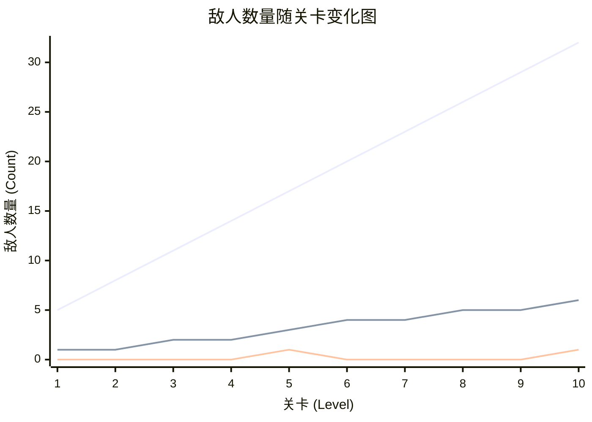
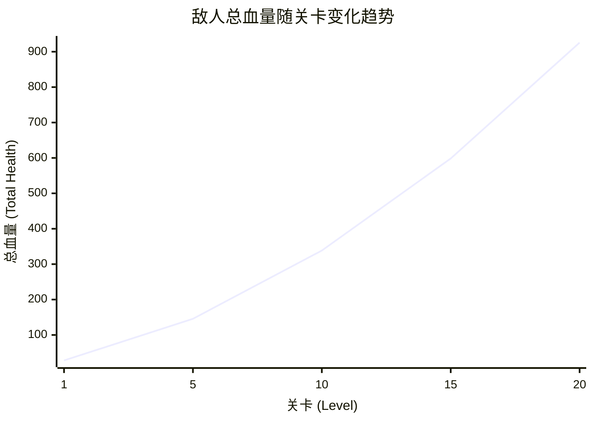

***

# 游戏策划案：防御塔-答题 (Quiz-Defense)

### **游戏机制核心概念总结：防御塔-答题**

这是一个将**知识问答**与**塔防策略**深度融合的游戏机制。玩家的核心任务是通过回答问题来获取战斗资源，并利用这些资源和策略性技能来抵御敌人的进攻。

游戏的核心在于平衡**知识储备**、**风险管理**和**战术决策**。

### **一、题库系统设计**

题库系统是游戏的知识内容基础，为答题机制提供丰富的日语学习素材。系统采用JLPT（日本语能力测试）标准分级，确保内容的系统性和渐进性。

#### 1. 题库分级规划

| JLPT级别 | 词汇数量 | 难度等级 | 设计目标 | 当前状态 |
| :--- | :--- | :--- | :--- | :--- |
| **N5** | 600词 | 入门级 | 基础日常词汇，适合初学者 | ✅ 已完成 |
| **N4** | 400词 | 初级 | 基础语法词汇，构建语言框架 | ✅ 已完成 |
| **N3** | 800词 | 中级 | 进阶词汇，提升表达能力 | 🔄 待开发 |
| **N2** | 1000词 | 中高级 | 复杂词汇，接近母语水平 | 🔄 待开发 |
| **N1** | 1500词 | 高级 | 专业词汇，达到熟练运用 | 🔄 待开发 |

**总计：4300个词汇**

#### 2. 题库数据结构

每个词汇条目包含完整的语言学习信息：

| 字段名称 | 数据类型 | 说明 | 示例 |
| :--- | :--- | :--- | :--- |
| **假名** | 字符串 | 日语读音 | あさごはん |
| **日语汉字** | 字符串 | 汉字写法 | 朝ご飯 |
| **中文翻译** | 字符串 | 中文含义 | 早饭 |
| **容易混淆的单词** | 字符串 | 相似词汇 | ひるごはん |
| **混淆词翻译** | 字符串 | 混淆词含义 | 午饭 |

#### 3. 题库解锁机制

- **初始解锁**：游戏开始时默认解锁N5级别题库
- **进度解锁**：完成当前级别50%的词汇后解锁下一级别
- **成就解锁**：通过特定成就可提前解锁高级别题库
- **自由选择**：玩家可自由选择已解锁的级别进行练习


### **二、题目类型设计**

题目类型设计旨在提供多样化的答题体验，通过不同的交互形式测试玩家的日语掌握程度。

#### 1. 基础选择题机制（已实现）

**题目形式**：中文翻译 → 选择日文翻译（4选1）

**生成逻辑**：
- 显示目标词汇的中文翻译
- 提供4个选项：1个正确答案，3个错误答案
- 错误答案来源：其他随机词汇的假名/汉字 + 当前词汇的混淆词
- 正确答案显示策略：80%概率显示汉字，20%概率显示假名（无汉字时强制显示假名）

**示例**：
```
题目：选择"早饭"的日文翻译
选项：[朝ご飯] [昼ご飯] [晩ご飯] [夜ご飯]
正确答案：朝ご飯
```

#### 2. 单词重组题型（待开发）

**设计理念**：测试玩家对日语词汇结构的深度理解，通过拆分重组的方式强化记忆。

**题目形式**：将目标词汇的假名和汉字拆散，混入干扰项，要求玩家正确排序组合。

**生成算法**：
```
1. 提取目标词汇的假名和汉字部分
2. 将假名按字符拆分，汉字保持整体
3. 添加2-3个干扰字符（来自同级别其他词汇）
4. 所有选项随机排序
5. 玩家需按正确顺序选择所有组成部分
```

**示例**：
```
题目：请组合出"学生"的正确写法
选项：[生] [学] [せ] [い] [め] [ん] [生] [学]
正确答案：[学] → [生] → [せ] → [い] → [め] → [ん]
```

**难度调节**：
- **简单模式**：提供部分正确顺序提示
- **标准模式**：完全随机排序
- **困难模式**：增加相似干扰项

#### 3. 题目生成策略

**随机性控制**：
- 确保同一词汇不会连续出现


**混淆项生成**：
- **语义混淆**：选择含义相近的词汇
- **字形混淆**：选择汉字相似或假名相似的词汇
- **音读混淆**：选择读音相近的词汇


### **三、奖励与成就系统**（待开发）

奖励系统连接答题表现与长期成长激励，为玩家提供明确的学习目标和成就感。

#### 1. 题库完成奖励

| 完成度 | 奖励内容 | 解锁内容 |
| :--- | :--- | :--- |
| **25%** | 天赋点 +10 | 基础天赋解锁 |
| **50%** | 天赋点 +25 | 下一级别题库解锁 |
| **75%** | 天赋点 +50 | 高级题型解锁 |
| **100%** | 天赋点 +100 | 专属奖杯 + 特殊称号 |

#### 2. 天赋点系统

**天赋点获取**：
- 每答对一题：+1天赋点
- 连续答对奖励：额外+0.5×连击数
- 完成题库里程碑：大量天赋点奖励

**天赋分类**：
- **学习天赋**：提升答题效率，减少错误惩罚
- **战斗天赋**：增强战斗能力，提升资源获取
- **通用天赋**：平衡学习与战斗的综合提升

#### 3. 奖杯/成就收集（待开发）

**收集类型**：
- **题库成就**：完成特定级别题库
- **连击成就**：达成特定连击数
- **准确率成就**：保持高准确率
- **学习时长成就**：累计学习时间

**特殊奖励**：
- **完美主义者**：100%完成所有题库
- **连击大师**：达成50连击
- **学习达人**：累计学习100小时
- **日语专家**：掌握所有N1词汇

### **四、核心资源系统**

游戏构建了一个三位一体、相互关联的资源循环系统。

| 资源名称 | 获取方式 | 主要用途 | 战略价值 |
| :--- | :--- | :--- | :--- |
| **能量点 (Energy Point, EP)** | 每答对一题获得 `+1` 点；答错时会 `-1` 点作为惩罚：初始值是5点 | 积攒以获取行动点 | 核心的长期战略资源，是获取终极资源“行动点”的唯一途径，承载着答题风险。 |
| **子弹 (Bullet)** | 1. 每答对一题获得 `+1` 颗；2. 消耗行动点可一次性装满 | 防御塔进行攻击的基础消耗品 | 直接影响战场的即时火力输出，是战术执行的基础。 |
| **行动点 (Action Point, AP)** | 能量点积满 `10` 点时获得 `+1` 点 | 消耗 `1` 点可立即重新装满子弹 | 强大的战略级资源，能在关键时刻提供爆发性的火力支援，扭转战局。 |

### **五、玩家基本单位**

玩家控制的主要防御单位具有以下基础属性：

| 属性名称 | 基础数值 | 说明 |
|:---------|:---------|:------|
| 攻击力(ATT) | 10 | 每发子弹造成的基础伤害值 |
| 生命值(HP) | 10 | 玩家可承受的最大伤害值 |
|暴击率|10%|一定概率暴击|
| 攻击速度 | 1次/秒 | 基础射击频率，可通过技能提升 |
| 射程 | 以player为圆心半径200px的圆| 可攻击视野内任意位置的敌人 |
| 位置 | 场景中间偏上位置 | 固定位置，无法移动 |


#### 玩家成长与经验系统

玩家的成长通过一个动态的经验值（EXP）和等级系统实现。该系统旨在奖励玩家持续正确的答题行为，并通过升级提供周期性的战略提升机会。

##### 1. 经验值（EXP）核心机制

| 机制 | 规则 | 说明 |
| :--- | :--- | :--- |
| **经验获取** | 每答对一题获得 `+1` EXP | 答错或跳过题目不获得任何经验值。 |
| **升级** | 当 `当前经验 ≥ 升级所需经验` 时，玩家等级 `+1`。 | 升级后，游戏将自动暂停，并弹出商店/升级界面，为玩家提供强化机会。 |
| **经验溢出** | 升级后，`当前经验 = 当前经验 - 升级所需经验` | 溢出的经验会完整保留，并计入下一等级的进度中。 |

##### 2. 升级所需经验计算

升级所需的经验值并非线性增长，而是遵循一个结合了**指数增长**和**周期性波动**的复杂公式，旨在创造一种动态变化的升级节奏。

**计算公式:**
```
升级所需经验 = floor( (基础经验 * (玩家等级 ^ 经验次方)) * (1 + 0.5 * cos(玩家等级 * 余弦频率)) )
```

**公式参数详解:**

| 参数 | 变量名 (`main.gd`) | 设定值 | 设计目的 |
| :--- | :--- | :--- | :--- |
| **基础经验** | `NextLevelExpBase` | 5 | 控制经验曲线的初始基准值。 |
| **经验次方** | `ExpPow` | 2.1 | 决定经验需求的核心增长速度，确保了长期升级的挑战性。 |
| **余弦频率** | `cosFre` | 0.5 | 为指数增长的经验曲线增加周期性波动，使得某些等级的提升会感觉略快或略慢，打破了单调的升级节奏。 |

##### 3. 经验曲线示例

下表展示了前几个等级所需的经验值，体现了其非线性的增长趋势。

| 当前等级 | 升至下一级所需经验 |
| :--- | :--- |
| 1 | 7 |
| 2 | 27 |
| 3 | 50 |
| 4 | 68 |
| 5 | 83 |

这种设计确保了玩家在游戏初期能较快地体验到成长乐趣，同时随着等级的提高，升级将变得更具挑战性，需要玩家持续保持高水平的答题表现。

### **六、游戏数值计算系统**

#### 1. 伤害计算基础公式

```
基础伤害 = 攻击力 × (1 + 攻击力加成) × 全局伤害加成
真实伤害 = 基础伤害 × 真实伤害系数
普通伤害 = 基础伤害 × (1 - 敌人护甲减免率)
暴击伤害 = 普通伤害 × (1 + 暴击系数)
最终伤害 = 真实伤害 + 暴击伤害
```
#### 2. 伤害加成系统

| 加成类型 | 计算方式 | 数值范围 | 触发条件 |
| :--- | :--- | :--- | :--- |
| **攻击力加成** | 乘算 | 0% ~ +∞% | 技能、buff等效果 |
| **全局伤害加成** | 乘算 | 0% ~ +∞% | 技能、buff等效果|
| **真实伤害系数** | 独立计算 | 0 - 0.3 | 技能、buff等效果|
| **暴击系数** | 乘算 | 50% - +无穷% | 基础10%概率 |
| **护甲减免** | 减算 | 0% - 100% | 敌人固有属性 |

各类加成可以同时存在并相互叠加，构成复杂的伤害计算体系。通过合理搭配技能，玩家可以追求更高的伤害输出。


### **七、技能触发器系统 (Skill Triggers)**


技能系统将玩家的答题表现与战场效果紧密相连。每个触发器下可挂载多个技能，但每次触发仅激活一个。

| 触发器名称 | 触发条件 | 设计目的与战略意义 |
| :--- | :--- | :--- |
| `onCombo` | 处于连续答对状态时，**每10秒触发一次** | 奖励持续稳定的表现，提供稳定的增益效果。 |
| `twoCombo` | **达成二连答**时触发一次 | 提供初期的、低门槛的连答奖励，鼓励玩家快速进入状态。 |
| `fiveCombo` | **达成五连答**时触发一次 | 提供强大的阶段性奖励，激励玩家挑战更高的连答数。 |
| `brokenCombo` | 连答状态中断时（**特指答错题目时**）触发一次 | 既是风险也是机遇。玩家可配置防御性技能来弥补失误，或配置特殊技能进行战术转换。 |
| `APGained` | 获得一点行动点时触发一次 | 强化获取高级资源的"里程碑时刻"，给予玩家额外的战略回报。 |
| `APSpent` | 消耗一点行动点时触发一次 | 使行动点的使用更具策略性，除了补充子弹外，还能附带一次性的强大战术效果。 |

### **八、 核心博弈点：答错 vs. 跳过**

设立"跳过"按钮旨在区分**"被迫的失败"**与**"主动的策略"**。

#### 1. 决策点对比

| 对比维度 | **答题错误 (Answering Wrong)** | **跳过题目 (Skipping)** |
| :--- | :--- | :--- |
| **本质定义** | 一次**失败的尝试** | 一次**主动的规避** |
| **资源后果** | **惩罚性**：`-1` 能量点 | **机会成本**：不获得任何资源，保住现有能量点 |
| **技能关联** | 触发 `brokenCombo` | **不触发任何技能**（遵循纯粹机会成本模型） |
| **战略意义** | 高风险的赌博行为，可能导致资源倒退 | **零风险的稳健选择**，用于**保护进度**和**管理节奏** |
| **玩家心态** | 承担风险，接受后果 | 权衡利弊，策略取舍 |

#### 2. "跳过"按钮的设计哲学探讨

本策划案的**共识**是采用**纯粹机会成本模型**：

*   **核心理念**：跳过即放弃，其唯一功能是**规避"答错扣分"的风险**。
*   **机制**：选择跳过时，不获得任何资源，也不损失任何资源，**不触发任何技能**。
*   **结论**：这是一种稳健、优雅的设计，将"跳过"精准地定位为一个纯粹的**防御性**和**风险管理**工具。

### **九、 技能树与机制设计**

#### 1. 基础强化系列：强化训练

| 系列名 | 技能名 | 前置技能 | 内容（主动技能） | 关键机制与优化点 |
| :--- | :--- | :--- | :--- | :--- |
| 强化训练 | 攻击力up | 无 | 攻击力+10% | 启动后永久性buff |
| 强化训练 | 攻击cdDown | 无 | 攻击cd-10%，最多减少至0.1s |启动后永久性buff永久性buff |
| 强化训练 | 真实伤害up | 无 | 真实伤害倍率+0.1|启动后永久性buff |
| 强化训练 | 火力全开 | 无 | buff期间全局伤害大幅提升100%，持续10秒。效果不可叠加，重复释放会清除buff。| 瞬时爆发型Buff。 |
#### 2. 弹药分裂与弹射系列：枪斗术

| 系列名 | 技能名 | 前置技能 | 内容（主动技能） | 关键机制与优化点 |
| :--- | :--- | :--- | :--- | :--- |
| 枪斗术 | QQ弹 | 无 | 触发技能时，【弹射】层数+1。每层【弹射】可使普通攻击的子弹在击中敌人后弹射一次（目标不能相同）。 | **层数制 Buff**： 每次普攻消耗一层。剩余层数保留并可叠加。 |
| 枪斗术 | 强力QQ弹 | QQ弹 | (被动) 【弹射】效果的弹射次数+1。 | 被动技能，强化【弹射】效果。 |
| 枪斗术 | 一枪双击 | 无 | 触发技能时，【分裂弹】层数+1。每层【分裂弹】可使普通攻击额外攻击一名敌人（目标不能相同）。 | **层数制 Buff**： 每次普攻消耗 Min(当前层数, 可用的额外目标数) 层。剩余层数保留并可叠加。 |

#### 3. 召唤系列：三重协议

| 系列名 | 技能名 | 前置技能 | 内容（主动技能） | 关键机制与优化点 |
| :--- | :--- | :--- | :--- | :--- |
| 三重协议 | BT-7270 | 无 | 生成防御塔bt7270 | 关联特殊单位机制，需定义触发方式（如主动技能、特定触发器）。 |

### **十、特殊机制说明**
### 1.BT-7270
BT-7270 是一个可生成的自动机枪炮塔，上限一个。

| 属性/机制 | 数值/说明 | 备注 |
| :--- | :--- | :--- |
| 存活时间 | 10 秒 | |
| 炮塔伤害 | 玩家伤害的 10% (每颗子弹) | |
| 射击模式 | 每次发射 4 颗子弹，每颗间隔 0.15s，一次性发射完。冷却 0.5s 后重新进入发射状态。 | |
| 索敌速度 | 炮身旋转速度 3 秒一圈。 | |

### 2. 火球术 (Fireball)
“火球术”是一个主动召唤技能，它会生成一个指向目标的火球

| 属性/机制 | 数值/说明 | 备注 |
| :--- | :--- | :--- |
| 技能类型 | 主动召唤技能 | 在玩家位置生成一个火球，飞向目标。 |
| 移动速度 | 200 像素/秒 | 火球以固定速度直线飞向目标初始位置。 |
| 伤害模式 | 范围伤害 (AoE) | 撞击到目标后爆炸，对爆炸范围内的所有敌人造成伤害。 |
| 伤害计算 | 造成玩家一定百分比的攻击力伤害。 | 具体伤害数值由技能等级或玩家属性决定。 |
| 生命周期 | 撞击敌人后消失 | 一次性消耗品。 ||


### 十一、关卡设计

根据 `level.gd` 脚本，游戏关卡设计遵循动态难度调整的无限模式。本设计旨在根据关卡进度动态调整敌人数量与属性，确保挑战性持续增长。

#### 敌人数量设计

| 关卡要素 | 设计规则 | 备注 |
| :--- | :--- | :--- |
| **关卡进程** | 游戏关卡数 (`currentLevel`) 无上限，从第 1 关开始。 | 每通过一关，`currentLevel` 自动加 1。 |
| **普通敌人数量** | `(当前关卡数 - 1) * 3 + 5` | 线性增长，确保基础挑战难度稳步提升。 |
| **精英敌人数量** | `普通敌人数量 / 5` (取整) | 精英敌人是普通敌人的强化版，拥有 **1.2 ~ 1.8** 倍的随机属性乘数。 |
| **敌人种类解锁** | 每 **5** 个关卡解锁一种新的敌人类型。 | 关卡 1-5 只有一种敌人，关卡 6-10 会出现两种，以此类推。 |
| **Boss 战** | 每 **5** 个关卡 (第 5, 10, 15... 关) 会出现一个 Boss。 | Boss 拥有固定的 **2.0** 倍属性乘数，是关卡的终极挑战。 |
| **生成机制** | 所有敌人（普通、精英、Boss）混合并随机排序后生成。 | 敌人从屏幕边缘的随机位置出现，生成间隔会从 1.0 秒动态缩短至 0.5 秒，增加后期压力。 |



#### 敌人属性设计

所有敌人的基础属性会随关卡数 (`currentLevel`) 提升。

| 属性 | 计算公式 | 说明 |
| :--- | :--- | :--- |
| **基础生命值 (Health)** | `5 + 2 * floor(当前关卡数 / 5)` | 敌人的基础生命值每 5 个关卡会阶梯式增长 2 点，形成阶段性的难度提升。 |
| **基础移动速度 (Speed)** | `基础速度 * (0.8 ~ 1.2 的随机值)` | 敌人的速度会在其基础值上下 20% 的范围内随机浮动，为战场带来更多变数。 |

##### 特殊敌人属性乘数

精英和 Boss 单位会基于一个属性乘数 (`Mul`) 对其基础属性进行强化，使其成为更严峻的挑战。

*   **精英敌人乘数 (`Mul`)**: 在 `1.2` 到 `1.8` 之间随机。
*   **Boss 乘数 (`Mul`)**: 固定为 `2.0`。

| 属性 | 强化公式 | 设计意图与战略影响 |
| :--- | :--- | :--- |
| **最终生命值** | `基础生命值 * Mul` | 大幅提升生存能力，成为需要优先处理或集中火力的目标。 |
| **最终尺寸** | `基础尺寸 * Mul` | 体型与威胁成正比，视觉上更具压迫感，同时也更容易被玩家的攻击命中。 |
| **最终速度** | `基础移动速度 * (2.0 - Mul)` | **反向关联机制**：属性乘数越高的敌人，移动速度越慢。这是一种平衡性设计，给予玩家应对强敌的策略空间。 |
| **最终伤害** | `基础伤害 * Mul` | 攻击威胁性显著增强，对玩家的生存构成直接挑战。 |
#### 敌人总血量与关卡关系分析

为了更好地理解关卡的难度曲线，我们拟合了敌人总血量随关卡数增长的趋势。此分析假设精英敌人的属性乘数取平均值 `1.6`。

##### 总血量计算公式

```
// 1. 定义关卡变量
L = 当前关卡数

// 2. 计算各类敌人数量
普通敌人总数 (N_total) = (L - 1) * 3 + 5
精英敌人数量 (N_elite) = floor(N_total / 5)
普通敌人净数量 (N_normal) = N_total - N_elite
Boss数量 (N_boss) = (L % 5 == 0) ? 1 : 0

// 3. 计算基础生命值
基础生命值 (H_base) = 5 + 2 * floor(L / 5)

// 4. 计算各类敌人总血量
普通敌人总血量 = N_normal * H_base
精英敌人总血量 = N_elite * H_base * 1.6
Boss总血量 = N_boss * H_base * 2.0

// 5. 计算关卡总血量
关卡总血量 (H_total) = 普通敌人总血量 + 精英敌人总血量 + Boss总血量
```

##### 关卡总血量示例

| 关卡 (L) | 普通敌人总数 | 精英敌人数量 | Boss数量 | 基础生命值 | 关卡总血量 (H_total) |
| :--- | :--- | :--- | :--- | :--- | :--- |
| 1 | 5 | 1 | 0 | 5 | 28.0 |
| 5 | 17 | 3 | 1 | 7 | 145.6 |
| 10 | 32 | 6 | 1 | 9 | 338.4 |
| 15 | 47 | 9 | 1 | 11 | 598.4 |
| 20 | 62 | 12 | 1 | 13 | 925.6 |

##### 总血量增长趋势图



### 十二、敌人种类 (Enemy Types)

#### 1. 僵尸 (Zomble)

作为游戏中的基础近战单位，僵尸构成了对玩家防御阵线的直接威胁。

| 属性/机制 | 描述 | 设计意图 |
| :--- | :--- | :--- |
| **单位类型** | 地面，近战 | 基础的地面推进单位，考验玩家的持续火力。 |
| **行为模式** | 1. **待机 (Idle):** 身体有轻微的缩放，呈现“呼吸”效果。<br>2. **移动 (Walk):** 生成后直线走向玩家。<br>3. **攻击 (Attack):** 到达攻击范围后，执行近战攻击。 | 简单的AI，行为可预测，是玩家熟悉游戏机制的入门敌人。 |
| **攻击方式** | 近战物理攻击 | 需要玩家在敌人靠近前将其消灭。 |
| **攻击间隔** | 10 秒 | 固定的攻击频率，为玩家提供了计算伤害输出窗口的机会。 |

#### 2. 飞行恶魔 (Fly Demon)

飞行恶魔是游戏中的第一个远程单位，它从远处发起攻击，考验玩家的目标选择和威胁评估能力。

| 属性/机制 | 描述 | 设计意图 |
| :--- | :--- | :--- |
| **单位类型** | 飞行，远程 | 无法被地面单位阻挡，需要玩家具备对空火力或优先处理的能力。 |
| **行为模式** | 1. **待机 (Idle):** 在原地悬浮，有轻微的上下浮动效果。<br>2. **移动 (Walk):** 生成后直线走向玩家，直到进入攻击范围。<br>3. **攻击 (Attack):** 到达攻击范围后停止移动，执行远程攻击。 | 引入远程威胁，迫使玩家不能只关注近处的敌人，增加了战场的复杂性。 |
| **攻击方式** | **火球术 (Fireball):** 发射一枚指向目标的火球。 | 指向性攻击为玩家提供了通过移动躲避的可能性，增加了操作空间。 |
| **索敌范围** | 半径 `400` ~ `550` 像素 (随机，具体以游戏内设计数值为准) | 随机化的索敌范围使得每次遭遇飞行恶魔的体验略有不同，增加了战斗的不可预测性。 |
|攻击间隔|10 秒|
